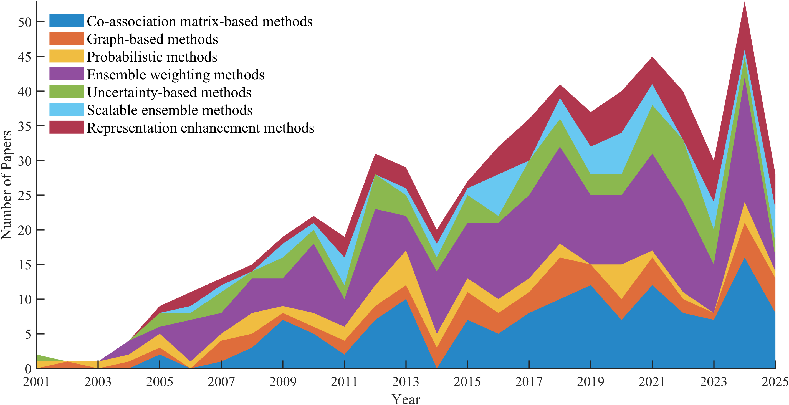
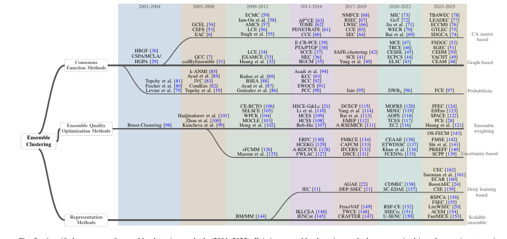

# Ensemble Clustering Review Explorer

<strong>An interactive companion resource for tracing the development of ensemble clustering across methods, benchmarks, and linked references.</strong>

<strong>Live web explorer:</strong> <a href="https://xuz2019.github.io/ensemble-clustering-survey-interactive-explorer/">https://xuz2019.github.io/ensemble-clustering-survey-interactive-explorer/</a>

The interactive explorer contains method-level information, dataset summaries, and a range of benchmark and experimental analyses in a browsable web interface.

This repository provides a companion resource on the development of ensemble clustering over the past 25 years.
For a more comprehensive discussion, please refer to the following survey:

**A Comprehensive Survey of Ensemble Clustering: Taxonomies, Methodologies, Experimental Benchmark, and Challenges**

## 📌 At a Glance

<table>
<tr>
<td width="33%" valign="top"><strong>Curated benchmark subset</strong> A benchmark-oriented subset of <strong>61</strong> representative papers aligned with the experimental section of the survey.</td>
<td width="33%" valign="top"><strong>Verified code links</strong> Currently <strong>31</strong> papers in the benchmark subset include a public code entry gathered from the curated code-link spreadsheet.</td>
<td width="33%" valign="top"><strong>Expanded bibliography</strong> A linked bibliography of <strong>605</strong> papers grouped under the same seven-category taxonomy.</td>
</tr>
</table>

## 🧭 Quick Navigation

| Section | What you will find |
| --- | --- |
| [Interactive Explorer](https://xuz2019.github.io/ensemble-clustering-survey-interactive-explorer/) | Live web interface for experimental analysis, dataset browsing, and method inspection |
| [Figures](#figures) | Visual overview of historical trend and methodology taxonomy |
| [Papers with Code](#papers-with-code) | Benchmark papers with verified public code links where available |
| [Complete Paper List](#complete-paper-list) | Full bibliography organized by the same seven categories |

## 🖼 Figures

<table>
<tr>
<td width="50%" align="center" valign="top">
<strong>📈 Fig. 1. Development Trend</strong>  

</td>
<td width="50%" align="center" valign="top">
<strong>🧩 Fig. 3. Methodology Taxonomy</strong>  

</td>
</tr>
</table>

## 💻 Papers with Code

> The table below contains the benchmark subset emphasized in the survey. Public code links are filled in when a verified repository or release page is available in the curated spreadsheet; `xxx` indicates that no verified public code link is currently listed.

| Category | Count |
| --- | ---: |
| 🎲 Probabilistic methods | 7 |
| 🕸 Graph-based methods | 9 |
| 🔗 CA Matrix-based methods | 19 |
| ⚡ Scalable ensemble methods | 6 |
| ⚖️ Ensemble weighting methods | 8 |
| ✨ Representation enhancement methods | 6 |
| 🌫 Uncertainty-based methods | 6 |

<strong>📋 Open the code-supported paper table</strong>

| Category | Paper | Authors | Venue | Year | Paper | Code |
| --- | --- | --- | --- | --- | --- | --- |
| 🎲 Probabilistic methods | A mixture model for clustering ensembles | Alexander Topchy et al | ICDM | 2004 | [Paper](https://doi.org/10.1137/1.9781611972740.35) | xxx |
| 🎲 Probabilistic methods | Clustering ensembles: Models of consensus and weak partitions | Alexander Topchy et al | IEEE TPAMI | 2005 | [Paper](https://doi.org/10.1109/tpami.2005.237) | xxx |
| 🎲 Probabilistic methods | Cumulative voting consensus method for partitions with variable number of clusters | Hanan G Ayad and Mohamed S Kamel | IEEE TPAMI | 2007 | [Paper](https://doi.org/10.1109/tpami.2007.1138) | xxx |
| 🎲 Probabilistic methods | Ensemble clustering using factor graph | Dong Huang et al | Pattern Recognition | 2016 | [Paper](https://doi.org/10.1016/j.patcog.2015.08.015) | [Code](https://github.com/huangdonghere/ECFG) |
| 🎲 Probabilistic methods | Fair clustering ensemble with equal cluster capacity | Peng Zhou et al | IEEE TPAMI | 2024 | [Paper](https://doi.org/10.1109/tpami.2024.3507857) | [Code](http://doctor-nobody.github.io/codes/FCE.7z) |
| 🎲 Probabilistic methods | Generalization Performance of Ensemble Clustering: From Theory to Algorithm | Xu Zhang et al | ICML | 2025 | [Paper](https://dblp.org/rec/conf/icml/ZhangQL0HJ25) | [Code](https://github.com/xuz2019/GPEC) |
| 🎲 Probabilistic methods | K-means-based consensus clustering: A unified view | Junjie Wu et al | IEEE TKDE | 2014 | [Paper](https://doi.org/10.1109/tkde.2014.2316512) | xxx |
| 🕸 Graph-based methods | Clustering ensemble via diffusion on adaptive multiplex | Peng Zhou et al | IEEE TKDE | 2023 | [Paper](https://doi.org/10.1109/tkde.2023.3311409) | [Code](http://doctor-nobody.github.io/codes/CEAM.zip) |
| 🕸 Graph-based methods | Clustering ensemble via structured hypergraph learning | Peng Zhou et al | Information Fusion | 2022 | [Paper](https://doi.org/10.1016/j.inffus.2021.09.003) | [Code](http://doctor-nobody.github.io/codes/code_CESHL.rar) |
| 🕸 Graph-based methods | Combining multiple clusterings via crowd agreement estimation and multi-granularity link analysis | Dong Huang et al | Neurocomputing | 2015 | [Paper](https://doi.org/10.1016/j.neucom.2014.05.094) | [Code](https://github.com/huangdonghere/WEAC_GPMGLA) |
| 🕸 Graph-based methods | Enhanced ensemble clustering via fast propagation of cluster-wise similarities | Dong Huang et al | IEEE TSMCS | 2018 | [Paper](https://doi.org/10.1109/tsmc.2018.2876202) | [Code](https://github.com/huangdonghere/ECPCS) |
| 🕸 Graph-based methods | Robust ensemble clustering using probability trajectories | Dong Huang et al | IEEE TKDE | 2015 | [Paper](https://doi.org/10.1109/tkde.2015.2503753) | [Code](https://github.com/huangdonghere/PTA_PTGP) |
| 🕸 Graph-based methods | Self-paced adaptive bipartite graph learning for consensus clustering | Peng Zhou et al | ACM TKDD | 2023 | [Paper](https://doi.org/10.1145/3564701) | [Code](http://doctor-nobody.github.io/codes/code_SCCABG.zip) |
| 🕸 Graph-based methods | Solving cluster ensemble problems by bipartite graph partitioning | Xiaoli Zhang Fern and Carla E Brodley | ICML | 2004 | [Paper](https://doi.org/10.1145/1015330.1015414) | xxx |
| 🕸 Graph-based methods | Tri-level robust clustering ensemble with multiple graph learning | Peng Zhou et al | AAAI | 2021 | [Paper](https://doi.org/10.1609/aaai.v35i12.17327) | [Code](http://doctor-nobody.github.io/codes/TRCE_code.zip) |
| 🕸 Graph-based methods | Dynamic anchor-based ensemble clustering via hypergraph reconstruction | Jiaxuan Xu et al | IJCAI | 2025 | [Paper](https://doi.org/10.24963/ijcai.2025/750) | [Code](https://github.com/scu-kdde/YACHT) |
| 🔗 CA Matrix-based methods | A multiple k-means clustering ensemble algorithm to find nonlinearly separable clusters | Liang Bai et al | Information Fusion | 2020 | [Paper](https://doi.org/10.1016/j.inffus.2020.03.009) | xxx |
| 🔗 CA Matrix-based methods | Enhancing ensemble clustering with adaptive high-order topological weights | Jiaxuan Xu et al | AAAI | 2024 | [Paper](https://doi.org/10.1609/aaai.v38i14.29552) | [Code](https://github.com/ltyong/awec) |
| 🔗 CA Matrix-based methods | Clustering ensemble meets low-rank tensor approximation | Yuheng Jia et al | AAAI | 2021 | [Paper](https://doi.org/10.1609/aaai.v35i9.16972) | [Code](https://github.com/jyh-learning/TensorClusteringEnsemble) |
| 🔗 CA Matrix-based methods | Combining multiple clusterings using evidence accumulation | Ana LN Fred and Anil K Jain | IEEE TPAMI | 2005 | [Paper](https://doi.org/10.1109/tpami.2005.113) | [Code](https://github.com/newbee-ML/clustering-ensemble--EAC) |
| 🔗 CA Matrix-based methods | Ensemble clustering via co-association matrix self-enhancement | Yuheng Jia et al | IEEE TNNLS | 2023 | [Paper](https://doi.org/10.1109/tnnls.2023.3249207) | [Code](https://github.com/Siritao/EC-CMS) |
| 🔗 CA Matrix-based methods | Ensemble clustering based on dense representation | Jie Zhou et al | Neurocomputing | 2019 | [Paper](https://doi.org/10.1016/j.neucom.2019.04.078) | [Code](https://github.com/sudalvxin/Ensemble-Clustering) |
| 🔗 CA Matrix-based methods | On regularizing multiple clusterings for ensemble clustering by graph tensor learning | Man-Sheng Chen et al | ACM MM | 2023 | [Paper](https://doi.org/10.1145/3581783.3612313) | [Code](https://github.com/ManshengChen/Code-for-GTLEC-master) |
| 🔗 CA Matrix-based methods | Got: a growing tree model for clustering ensemble | Feijiang Li et al | AAAI | 2021 | [Paper](https://doi.org/10.1609/aaai.v35i9.17015) | [Code](https://github.com/FeijiangLi/Code-GoT-a-growing-tree-model-for-clustering-ensemble-AAAI-21-) |
| 🔗 CA Matrix-based methods | LCE: a link-based cluster ensemble method for improved gene expression data analysis | Natthakan Iam-On et al | Bioinformatics | 2010 | [Paper](https://doi.org/10.1093/bioinformatics/btq226) | xxx |
| 🔗 CA Matrix-based methods | Locally weighted ensemble clustering | Dong Huang et al | IEEE TCYB | 2017 | [Paper](https://doi.org/10.1109/tcyb.2017.2702343) | [Code](https://github.com/huangdonghere/LWEA_LWGP) |
| 🔗 CA Matrix-based methods | Robust spectral ensemble clustering | Zhiqiang Tao et al | ACM CIKM | 2016 | [Paper](https://doi.org/10.1145/2983323.2983745) | [Code](https://github.com/Li-Hongmin/Implementation-of-Robust-Spectral-Ensemble-Clustering) |
| 🔗 CA Matrix-based methods | Similarity and dissimilarity guided co-association matrix construction for ensemble clustering | Xu Zhang et al | IEEE TKDE | 2025 | [Paper](https://doi.org/10.1109/tkde.2025.3608721) | [Code](https://github.com/xuz2019/SDGCA) |
| 🔗 CA Matrix-based methods | Spectral ensemble clustering via weighted k-means: Theoretical and practical evidence | Hongfu Liu et al | IEEE TKDE | 2017 | [Paper](https://doi.org/10.1109/tkde.2017.2650229) | [Code](https://github.com/Li-Hongmin/Implementation_of_Spectral_Ensemble_Clustering_via_Weighted_K-Means) |
| 🔗 CA Matrix-based methods | Towards Balance Adaptive Weighted Ensemble Clustering | Runxin Zhang et al | IEEE TCSVT | 2025 | [Paper](https://doi.org/10.1109/tcsvt.2025.3531199) | [Code](https://github.com/zrx11/Towards-Balance-Adaptive-Weighted-Ensemble-Clustering) |
| 🔗 CA Matrix-based methods | A clustering ensemble: Two-level-refined co-association matrix with path-based transformation | Caiming Zhong et al | Pattern Recognition | 2015 | [Paper](https://doi.org/10.1016/j.patcog.2015.02.014) | xxx |
| 🔗 CA Matrix-based methods | A matrix factorization approach for integrating multiple data views | Derek Greene and Padraig Cunningham | LNCS | 2009 | [Paper](https://doi.org/10.1007/978-3-642-04180-8_45) | xxx |
| 🔗 CA Matrix-based methods | From ensemble clustering to multi-view clustering | Zhiqiang Tao et al | IJCAI | 2017 | [Paper](https://doi.org/10.24963/ijcai.2017/396) | xxx |
| 🔗 CA Matrix-based methods | Multi-view ensemble clustering via low-rank and sparse decomposition: from matrix to tensor | Xuanqi Zhang et al | ACM TKDD | 2023 | [Paper](https://doi.org/10.1145/3589768) | [Code](https://github.com/xuan7zhang/Multi-View-Ensemble-Clustering-via-Low-Rank-and-Sparse-Decomposition-from-Matrix-to-Tensor) |
| 🔗 CA Matrix-based methods | Multi-view document clustering via ensemble method | Syed Fawad Hussain et al | JIIS | 2014 | [Paper](https://doi.org/10.1007/s10844-014-0307-6) | xxx |
| ⚡ Scalable ensemble methods | A scalable framework for cluster ensembles | Prodip Hore et al | Pattern Recognition | 2009 | [Paper](https://doi.org/10.1016/j.patcog.2008.09.027) | xxx |
| ⚡ Scalable ensemble methods | A three-way cluster ensemble approach for large-scale data | Hong Yu et al | IJAR | 2019 | [Paper](https://doi.org/10.1016/j.ijar.2019.09.001) | xxx |
| ⚡ Scalable ensemble methods | Effects of resampling method and adaptation on clustering ensemble efficacy | Behrouz Minaei-Bidgoli et al | Artificial Intelligence Review | 2014 | [Paper](https://doi.org/10.1007/s10462-011-9295-x) | xxx |
| ⚡ Scalable ensemble methods | Anchor-based fast spectral ensemble clustering | Runxin Zhang et al | Information Fusion | 2025 | [Paper](https://doi.org/10.1016/j.inffus.2024.102587) | [Code](https://github.com/zrx11/Anchor-Based-Fast-Spectral-Ensemble-Clustering) |
| ⚡ Scalable ensemble methods | Fast multi-view clustering via ensembles: Towards scalability, superiority, and simplicity | Dong Huang et al | IEEE TKDE | 2023 | [Paper](https://doi.org/10.1109/tkde.2023.3236698) | [Code](https://github.com/huangdonghere/FastMICE) |
| ⚡ Scalable ensemble methods | Ultra-scalable spectral clustering and ensemble clustering | Dong Huang et al | IEEE TKDE | 2019 | [Paper](https://doi.org/10.1109/tkde.2019.2903410) | [Code](https://github.com/huangdonghere/USPEC_USENC) |
| ⚖️ Ensemble weighting methods | Bagging-based spectral clustering ensemble selection | Jianhua Jia et al | Pattern Recognition Letters | 2011 | [Paper](https://doi.org/10.1016/j.patrec.2011.04.008) | xxx |
| ⚖️ Ensemble weighting methods | Hybrid sampling-based clustering ensemble with global and local constitutions | Yun Yang and Jianmin Jiang | IEEE TNNLS | 2015 | [Paper](https://doi.org/10.1109/tnnls.2015.2430821) | xxx |
| ⚖️ Ensemble weighting methods | Toward multidiversified ensemble clustering of high-dimensional data: From subspaces to metrics and beyond | Dong Huang et al | IEEE TCYB | 2021 | [Paper](https://doi.org/10.1109/tcyb.2021.3049633) | [Code](https://github.com/huangdonghere/MDEC) |
| ⚖️ Ensemble weighting methods | Moderate diversity for better cluster ensembles | Stefan T Hadjitodorov et al | Information Fusion | 2006 | [Paper](https://doi.org/10.1016/j.inffus.2005.01.008) | xxx |
| ⚖️ Ensemble weighting methods | Self-paced clustering ensemble | Peng Zhou et al | IEEE TNNLS | 2020 | [Paper](https://doi.org/10.1109/tnnls.2020.2984814) | [Code](http://doctor-nobody.github.io/codes/code_spce.rar) |
| ⚖️ Ensemble weighting methods | Weighted partition consensus via kernels | Sandro Vega-Pons et al | Pattern Recognition | 2010 | [Paper](https://doi.org/10.1016/j.patcog.2010.03.001) | xxx |
| ⚖️ Ensemble weighting methods | Weighted-object ensemble clustering | Yazhou Ren et al | ICDM | 2013 | [Paper](https://doi.org/10.1109/icdm.2013.80) | [Code](https://github.com/Yazhou-Ren/WOEC) |
| ⚖️ Ensemble weighting methods | An ensemble framework for clustering protein-protein interaction networks | Sitaram Asur et al | Bioinformatics | 2007 | [Paper](https://doi.org/10.1093/bioinformatics/btm212) | xxx |
| ✨ Representation enhancement methods | Contrastive Ensemble Clustering | Man-Sheng Chen et al | IEEE TNNLS | 2025 | [Paper](https://doi.org/10.1109/tnnls.2025.3531903) | xxx |
| ✨ Representation enhancement methods | Deep multi-view spectral clustering via ensemble | Mingyu Zhao et al | PR | 2023 | [Paper](https://doi.org/10.1016/j.patcog.2023.109836) | xxx |
| ✨ Representation enhancement methods | scBGEDA: deep single-cell clustering analysis via a dual denoising autoencoder with bipartite graph ensemble clustering | Yunhe Wang et al | Bioinformatics | 2023 | [Paper](https://doi.org/10.1093/bioinformatics/btad075) | xxx |
| ✨ Representation enhancement methods | Jointly learn the base clustering and ensemble for deep image clustering | Chen Liang et al | ICME | 2024 | [Paper](https://doi.org/10.1109/icme57554.2024.10687406) | xxx |
| ✨ Representation enhancement methods | CCEGAN: Enhancing GAN clustering through contrastive clustering ensemble | Jie Yan et al | Information Sciences | 2025 | [Paper](https://doi.org/10.1016/j.ins.2024.121663) | xxx |
| ✨ Representation enhancement methods | An Ensemble of Deep Clustering Models With Autoencoders to Mine Travel Patterns From Smart Card Data | Sharon Saronian et al | IEEE TITS | 2024 | [Paper](https://doi.org/10.1109/tits.2024.3475295) | xxx |
| 🌫 Uncertainty-based methods | Consensus-based ensembles of soft clusterings | Kunal Punera and Joydeep Ghosh | Applied Artificial Intelligence | 2008 | [Paper](https://doi.org/10.1080/08839510802170546) | xxx |
| 🌫 Uncertainty-based methods | Fuzzy ensemble clustering based on random projections for DNA microarray data analysis | Roberto Avogadri and Giorgio Valentini | Artificial Intelligence in Medicine | 2009 | [Paper](https://doi.org/10.1016/j.artmed.2008.07.014) | xxx |
| 🌫 Uncertainty-based methods | Hierarchical cluster ensemble model based on knowledge granulation | Jie Hu et al | KBS | 2016 | [Paper](https://doi.org/10.1016/j.knosys.2015.10.006) | xxx |
| 🌫 Uncertainty-based methods | Multigranulation information fusion: A Dempster-Shafer evidence theory-based clustering ensemble method | Feijiang Li et al | Information Sciences | 2017 | [Paper](https://doi.org/10.1016/j.ins.2016.10.008) | xxx |
| 🌫 Uncertainty-based methods | Reliability-based fuzzy clustering ensemble | Ali Bagherinia et al | FSS | 2021 | [Paper](https://doi.org/10.1016/j.fss.2020.03.008) | xxx |
| 🌫 Uncertainty-based methods | Fuzzy ensemble clustering based on self-coassociation and prototype propagation | Feijiang Li et al | IEEE TFS | 2023 | [Paper](https://doi.org/10.1109/tfuzz.2023.3262256) | [Code](https://github.com/FeijiangLi/Fuzzy-Ensemble-Clustering-Based-on-Self-Co-Association-and-Prototype-Propagation) |

## 📚 Complete Paper List

> The full bibliography below is organized under the same taxonomy as the survey. Each category is collapsible to keep the project homepage easier to browse.

| Category | Papers | Jump |
| --- | ---: | --- |
| 🎲 Probabilistic methods | 44 | [Open](#probabilistic-methods) |
| 🕸 Graph-based methods | 58 | [Open](#graph-based-methods) |
| 🔗 CA Matrix-based methods | 137 | [Open](#ca-matrix-based-methods) |
| ⚡ Scalable ensemble methods | 45 | [Open](#scalable-ensemble-methods) |
| ⚖️ Ensemble weighting methods | 179 | [Open](#ensemble-weighting-methods) |
| ✨ Representation enhancement methods | 71 | [Open](#representation-enhancement-methods) |
| 🌫 Uncertainty-based methods | 71 | [Open](#uncertainty-based-methods) |

<strong>🗂 Open category contents</strong>

- [🎲 Probabilistic methods](#probabilistic-methods) (44)
- [🕸 Graph-based methods](#graph-based-methods) (58)
- [🔗 CA Matrix-based methods](#ca-matrix-based-methods) (137)
- [⚡ Scalable ensemble methods](#scalable-ensemble-methods) (45)
- [⚖️ Ensemble weighting methods](#ensemble-weighting-methods) (179)
- [✨ Representation enhancement methods](#representation-enhancement-methods) (71)
- [🌫 Uncertainty-based methods](#uncertainty-based-methods) (71)

<strong>🎲 Probabilistic methods</strong> <code>44 papers</code>

1. **"Clustering Ensembles Based on Probability Density Function Estimation."** Yingyan Wu et al. 2020 7th IEEE International Conference on Cyber Security and Cloud Computing (CSCloud)/2020 6th IEEE International Conference on Edge Computing and Scalable Cloud (EdgeCom) 2020. [Paper](https://doi.org/10.1109/cscloud-edgecom49738.2020.00029)
2. **"Fair Clustering Ensemble With Equal Cluster Capacity."** Peng Zhou et al. IEEE Transactions on Pattern Analysis and Machine Intelligence 2024. [Paper](https://doi.org/10.1109/tpami.2024.3507857)
3. **"Generalization Performance of Ensemble Clustering: From Theory to Algorithm."** Xu Zhang et al. arXiv (Cornell University) 2025. [Paper](https://dblp.org/rec/conf/icml/ZhangQL0HJ25)
4. **"SoPD - A New Consensus Function for the Ensemble Clustering Problem."** Daniel Duarte Abdala and Xiaoyi Jiang. 2012 31st International Conference of the Chilean Computer Science Society 2012. [Paper](https://doi.org/10.1109/sccc.2012.38)
5. **"New Cluster Detection using Semi-supervised Clustering Ensemble Method."** Huaying Li and Aleksandar Jeremic. Proceedings of the 11th International Joint Conference on Biomedical Engineering Systems and Technologies 2018. [Paper](https://doi.org/10.5220/0006653802210226)
6. **"ECBN: Ensemble Clustering based on Bayesian Network inference for Single-cell RNA-seq Data."** Dexin Zhang and Yuan Zhu. 2020 39th Chinese Control Conference (CCC) 2020. [Paper](https://doi.org/10.23919/ccc50068.2020.9188589)
7. **"Ensemble clustering via synchronized relabelling."** Michele Alziati et al. Pattern Recognition Letters 2024. [Paper](https://doi.org/10.1016/j.patrec.2024.06.026)
8. **"A Latent Variable Pairwise Classification Model of a Clustering Ensemble."** Vladimir Berikov. Lecture Notes in Computer Science 2011. [Paper](https://doi.org/10.1007/978-3-642-21557-5_30)
9. **"Bayesian Consensus Clustering."** Eric F. Lock and David B. Dunson. Bioinformatics 2013. [Paper](https://doi.org/10.1093/bioinformatics/btt425)
10. **"A Kernel Probabilistic Model for Semi-supervised Co-clustering Ensemble."** Yinghui Zhang. Journal of Intelligent Systems 2017. [Paper](https://doi.org/10.1515/jisys-2017-0513)
11. **"A Generative Time Series Clustering Framework Based on an Ensemble Mixture of HMMs."** Mohamad Kanaan et al. 2020 IEEE 32nd International Conference on Tools with Artificial Intelligence (ICTAI) 2020. [Paper](https://doi.org/10.1109/ictai50040.2020.00126)
12. **"Gaussian gravitation for cluster ensembles."** Kai Cong et al. Knowledge-Based Systems 2022. [Paper](https://doi.org/10.1016/j.knosys.2022.109444)
13. **"Using Bagging to improve clustering methods in the context of three-dimensional shapes."** Inácio Nascimento et al. Advances in Data Analysis and Classification 2024. [Paper](https://doi.org/10.1007/s11634-024-00602-9)
14. **"Automatic Segmentation of Interest Regions in Low Depth of Field Images Using Ensemble Clustering and Graph Cut Optimization Approaches."** G. Rafiee et al. 2012 IEEE International Symposium on Multimedia 2012. [Paper](https://doi.org/10.1109/ism.2012.39)
15. **"A Self-Supervised Framework for Clustering Ensemble."** Liang Du et al. Lecture Notes in Computer Science 2013. [Paper](https://doi.org/10.1007/978-3-642-38562-9_26)
16. **"The Mean Partition Theorem in consensus clustering."** Brijnesh J. Jain. Pattern Recognition 2018. [Paper](https://doi.org/10.1016/j.patcog.2018.01.030)
17. **"Better than the best: Answers via model ensemble in density-based clustering."** Alessandro Casa et al. Advances in Data Analysis and Classification 2020. [Paper](https://doi.org/10.1007/s11634-020-00423-6)
18. **"Ensemble attribute profile clustering_discovering and characterizing groups of genes with similar patterns of biological features."** JR Semeiks et al. BMC Bioinformatics 2006. [Paper](https://doi.org/10.1186/1471-2105-7-147)
19. **"EC-PGMGR: Ensemble Clustering Based on Probability Graphical Model With Graph Regularization for Single-Cell RNA-seq Data."** Yuan Zhu et al. Frontiers in Genetics 2020. [Paper](https://doi.org/10.3389/fgene.2020.572242)
20. **"Unsupervised ensemble minority clustering."** Edgar Gonzàlez and Jordi Turmo. Machine Learning 2013. [Paper](https://doi.org/10.1007/s10994-013-5394-z)
21. **"Unsupervised Ensemble Minority Clustering."** Edgar Gonzàlez and Jordi Turmo. Machine Learning 2015. [Paper](https://doi.org/10.1007/s10994-013-5394-z)
22. **"Unsupervised Relation Extraction by Massive Clustering."** Edgar Gonzàlez and Jordi Turmo. 2009 Ninth IEEE International Conference on Data Mining 2009. [Paper](https://doi.org/10.1109/icdm.2009.81)
23. **"GA-Based Membrane Evolutionary Algorithm for Ensemble Clustering."** Yanhua Wang et al. Computational Intelligence and Neuroscience 2017. [Paper](https://doi.org/10.1155/2017/4367342)
24. **"Creating Discriminative Models for Time Series Classification and Clustering by HMM Ensembles."** Nazanin Asadi et al. IEEE Transactions on Cybernetics 2016. [Paper](https://doi.org/10.1109/tcyb.2015.2492920)
25. **"Nonparametric Bayesian Clustering Ensembles."** Pu Wang et al. Lecture Notes in Computer Science 2010. [Paper](https://doi.org/10.1007/978-3-642-15939-8_28)
26. **"Bayesian cluster ensembles."** Hongjun Wang et al. Statistical Analysis and Data Mining The ASA Data Science Journal 2011. [Paper](https://doi.org/10.1002/sam.10098)
27. **"Non-redundant clustering with conditional ensembles."** David Gondek and Thomas Hofmann. Proceedings of the eleventh ACM SIGKDD international conference on Knowledge discovery in data mining 2005. [Paper](https://doi.org/10.1145/1081870.1081882)
28. **"From cluster ensemble to structure ensemble."** Zhiwen Yu et al. Information Sciences 2012. [Paper](https://doi.org/10.1016/j.ins.2012.02.019)
29. **"Probabilistic consensus clustering using evidence accumulation."** André Lourenço et al. Machine Learning 2013. [Paper](https://doi.org/10.1007/s10994-013-5339-6)
30. **"Region-of-Interest Extraction in Low Depth-of-Field Images Using Ensemble Clustering and Difference of Gaussian Approaches."** G. Rafiee et al. Pattern Recognition 2013. [Paper](https://doi.org/10.1016/j.patcog.2013.03.006)
31. **"Probabilistic cluster structure ensemble."** Zhiwen Yu et al. Information Sciences 2014. [Paper](https://doi.org/10.1016/j.ins.2014.01.030)
32. **"Ensemble clustering with voting active clusters."** Kagan Tumer and Adrian K. Agogino. Pattern Recognition Letters 2008. [Paper](https://doi.org/10.1016/j.patrec.2008.06.011)
33. **"Solving Soft Clustering Ensemble via k-Sparse Discrete Wasserstein Barycenter."** Ruizhe Qin et al. Neural Information Processing Systems 2021. [Paper](https://dblp.org/rec/conf/nips/QinLD21)
34. **"k-ANMI: A mutual information based clustering algorithm for categorical data."** Zengyou He et al. Information Fusion 2008. [Paper](https://doi.org/10.1016/j.inffus.2006.05.006)
35. **"Ensemble clustering by means of clustering embedding in vector spaces."** Lucas Franek and Xiaoyi Jiang. Pattern Recognition 2014. [Paper](https://doi.org/10.1016/j.patcog.2013.08.019)
36. **"On voting-based consensus of cluster ensembles."** Hanan G. Ayad and Mohamed S. Kamel. Pattern Recognition 2010. [Paper](https://doi.org/10.1016/j.patcog.2009.11.012)
37. **"Ensemble clustering using factor graph."** Dong Huang et al. Pattern Recognition 2016. [Paper](https://doi.org/10.1016/j.patcog.2015.08.015)
38. **"Bagging for Path-Based Clustering."** B. Fischer and J.M. Buhmann. IEEE Transactions on Pattern Analysis and Machine Intelligence 2003. [Paper](https://doi.org/10.1109/tpami.2003.1240115)
39. **"Consensus Clusterings."** Nam Nguyen and Rich Caruana. Seventh IEEE International Conference on Data Mining (ICDM 2007) 2007. [Paper](https://doi.org/10.1109/icdm.2007.73)
40. **"Cumulative Voting Consensus Method for  Partitions with a Variable Number of Clusters."** H.G. Ayad and M.S. Kamel. IEEE Transactions on Pattern Analysis and Machine Intelligence 2008. [Paper](https://doi.org/10.1109/tpami.2007.1138)
41. **"Resampling Method for Unsupervised Estimation of Cluster Validity."** Erel Levine and Eytan Domany. Neural Computation 2001. [Paper](https://doi.org/10.1162/089976601753196030)
42. **"K-means-Based Consensus Clustering: A Unified View."** Junjie Wu et al. IEEE Transactions on Knowledge and Data Engineering 2015. [Paper](https://doi.org/10.1109/tkde.2014.2316512)
43. **"A Mixture Model for Clustering Ensembles."** Alexander Topchy et al. Proceedings of the 2004 SIAM International Conference on Data Mining 2004. [Paper](https://doi.org/10.1137/1.9781611972740.35)
44. **"Clustering Ensembles: Models of Consensus and Weak Partitions."** A. Topchy et al. IEEE Transactions on Pattern Analysis and Machine Intelligence 2005. [Paper](https://doi.org/10.1109/tpami.2005.237)

<strong>🕸 Graph-based methods</strong> <code>58 papers</code>

1. **"Clustering Aggregation."** A. Gionis et al. ACM Transactions on Knowledge Discovery from Data 2007. [Paper](https://doi.org/10.1145/1217299.1217303)
2. **"HMM-based hybrid meta-clustering ensemble for temporal data."** Yun Yang and Jianmin Jiang. Knowledge-Based Systems 2014. [Paper](https://doi.org/10.1016/j.knosys.2013.12.004)
3. **"Ensemble Clustering Model of Hyperspectral Image Segmentation."** Mengmeng Wu et al. 2017 9th International Conference on Advanced Infocomm Technology (ICAIT) 2017. [Paper](https://doi.org/10.1109/icait.2017.8388945)
4. **"Dominant-Set-Based Consensus for Fuzzy C-Means Clustering Ensemble."** Pan Su et al. 2018 International Conference on Machine Learning and Cybernetics (ICMLC) 2018. [Paper](https://doi.org/10.1109/icmlc.2018.8526927)
5. **"Ensemble Learning for Spectral Clustering."** Hongmin Li et al. 2020 IEEE International Conference on Data Mining (ICDM) 2020. [Paper](https://doi.org/10.1109/icdm50108.2020.00131)
6. **"Enhanced Spectral Ensemble Clustering for Fault Diagnosis: Application to Photovoltaic Systems."** Mohsen Zargarani et al. IEEE Access 2024. [Paper](https://doi.org/10.1109/access.2024.3497977)
7. **"Multiview ensemble clustering of hypergraph p-Laplacian regularization with weighting and denoising."** Dacheng Zheng et al. Information Sciences 2024. [Paper](https://doi.org/10.1016/j.ins.2024.121187)
8. **"Structured Bipartite Graph Ensemble Clustering."** Chen Wang et al. Proceedings of the 6th ACM International Conference on Multimedia in Asia 2024. [Paper](https://doi.org/10.1145/3696409.3700265)
9. **"Dynamic Anchor-based Ensemble Clustering via Hypergraph Reconstruction."** Jiaxuan Xu；Lei Duan；Xinye Wang；Liang Du. Proceedings of the Thirty-ThirdInternational Joint Conference on Artificial Intelligence 2024. [Paper](https://doi.org/10.24963/ijcai.2024/750)
10. **"Neighbor self-embedding graph model for clustering ensemble."** Siyang Li et al. Applied Soft Computing 2025. [Paper](https://doi.org/10.1016/j.asoc.2025.112844)
11. **"Structured Graph-Based Ensemble Clustering."** Xuan Zheng et al. IEEE Transactions on Knowledge and Data Engineering 2025. [Paper](https://doi.org/10.1109/tkde.2025.3546502)
12. **"Evolutionary role mining in complex networks by ensemble clustering."** Sarvenaz Choobdar et al. Proceedings of the Symposium on Applied Computing 2017. [Paper](https://doi.org/10.1145/3019612.3019815)
13. **"Clustering ensemble method."** Tahani Alqurashi and Wenjia Wang. International Journal of Machine Learning and Cybernetics 2018. [Paper](https://doi.org/10.1007/s13042-017-0756-7)
14. **"A Link and Weight-Based Ensemble Clustering for Patient Stratification."** Yuan-Yuan Zhang et al. Lecture Notes in Computer Science 2019. [Paper](https://doi.org/10.1007/978-3-030-26969-2_24)
15. **"Clustering Ensemble via Cluster-wise Optimization Graph Learning."** Huan Zhang and Liang Du. 2021 IEEE International Conference on Recent Advances in Systems Science and Engineering (RASSE) 2021. [Paper](https://doi.org/10.1109/rasse53195.2021.9686881)
16. **"Clustering Ensemble-based Edge Bundling to Improve the Readability of Graph Drawings."** Raissa S. Vieira et al. 2022 26th International Conference Information Visualisation (IV) 2022. [Paper](https://doi.org/10.1109/iv56949.2022.00013)
17. **"Clustering Ensemble and Application in HST Dataset."** Wenchao Xiao et al. 2014 IEEE International Conference on Data Mining Workshop 2014. [Paper](https://doi.org/10.1109/icdmw.2014.143)
18. **"Double High-Order Correlation Preserved Robust Multi-View Ensemble Clustering."** Xiaojia Zhao et al. ACM Transactions on Multimedia Computing, Communications, and Applications 2023. [Paper](https://doi.org/10.1145/3612923)
19. **"k-HyperEdge Medoids for Clustering Ensemble."** Feijiang Li et al. Proceedings of the AAAI Conference on Artificial Intelligence 2025. [Paper](https://doi.org/10.1609/aaai.v39i17.34010)
20. **"Auto-weighted Graph Reconstruction for efficient ensemble clustering."** Xiaojun Yang et al. Information Sciences 2025. [Paper](https://doi.org/10.1016/j.ins.2024.121486)
21. **"Spectral clustering ensemble for image segmentation."** Xiuli Ma et al. Proceedings of the first ACM/SIGEVO Summit on Genetic and Evolutionary Computation 2009. [Paper](https://doi.org/10.1145/1543834.1543890)
22. **"Optimizing Connectivity-Driven Brain Parcellation Using Ensemble Clustering."** Anvar Kurmukov et al. Brain Connectivity 2020. [Paper](https://doi.org/10.1089/brain.2019.0722)
23. **"Fast self-supervised discrete graph clustering with ensemble local cluster constraints."** Xiaojun Yang et al. Neural Networks 2025. [Paper](https://doi.org/10.1016/j.neunet.2025.107421)
24. **"Spectral aggregation for clustering ensemble."** Xi Wang et al. 2008 19th International Conference on Pattern Recognition 2008. [Paper](https://doi.org/10.1109/icpr.2008.4761779)
25. **"Unsupervised texture image segmentation using multiobjective evolutionary clustering ensemble algorithm."** Xiaoxue Qian et al. 2008 IEEE Congress on Evolutionary Computation (IEEE World Congress on Computational Intelligence) 2008. [Paper](https://doi.org/10.1109/cec.2008.4631279)
26. **"Exploiting the Wisdom of Crowd: A Multi-granularity Approach to Clustering Ensemble."** Dong Huang et al. Lecture Notes in Computer Science 2013. [Paper](https://doi.org/10.1007/978-3-642-42057-3_15)
27. **"Ensemble document clustering using weighted hypergraph generated by NMF."** Hiroyuki Shinnou and Minoru Sasaki. Proceedings of the 45th Annual Meeting of the ACL on Interactive Poster and Demonstration Sessions - ACL '07 2007. [Paper](https://doi.org/10.3115/1557769.1557793)
28. **"Robust Clustering of Multi-type Relational Data via a Heterogeneous Manifold Ensemble."** Richi Nayak Jun Hou. 2015 IEEE 31st International Conference on Data Engineering 2015. [Paper](https://doi.org/10.1109/icde.2015.7113319)
29. **"Metacluster-based Projective Clustering Ensembles."** Francesco Gullo et al. Machine Learning 2015. [Paper](https://doi.org/10.1007/s10994-013-5395-y)
30. **"SAFE-clustering: Single-cell Aggregated (from Ensemble) clustering for single-cell RNA-seq data."** Yuchen Yang et al. Bioinformatics 2018. [Paper](https://doi.org/10.1093/bioinformatics/bty793)
31. **"An ensemble based on a bi-objective evolutionary spectral algorithm for graph clustering."** Camila P.S. Tautenhain and Mariá C.V. Nascimento. Expert Systems with Applications 2020. [Paper](https://doi.org/10.1016/j.eswa.2019.112911)
32. **"Markov clustering ensemble."** Luqing Wang et al. Knowledge-Based Systems 2022. [Paper](https://doi.org/10.1016/j.knosys.2022.109196)
33. **"Adaptive Fuzzy Exponent Cluster Ensemble System Based Feature Selection and Spectral Clustering."** Abdelkarim Ben Ayed et al. 2017 IEEE International Conference on Fuzzy Systems (FUZZ-IEEE) 2017. [Paper](https://doi.org/10.1109/fuzz-ieee.2017.8015721)
34. **"Relational co-clustering via manifold ensemble learning."** Ping Li et al. Proceedings of the 21st ACM international conference on Information and knowledge management 2012. [Paper](https://doi.org/10.1145/2396761.2398498)
35. **"A Framework for Hierarchical Ensemble Clustering."** Li Zheng et al. ACM Transactions on Knowledge Discovery from Data 2014. [Paper](https://doi.org/10.1145/2611380)
36. **"Revealing community structures by ensemble clustering using group diffusion."** Elena Ivannikova et al. Information Fusion 2018. [Paper](https://doi.org/10.1016/j.inffus.2017.09.013)
37. **"Co-Clustering Ensembles Based on Multiple Relevance Measures."** Xianxue Yu et al. IEEE Transactions on Knowledge and Data Engineering 2019. [Paper](https://doi.org/10.1109/tkde.2019.2942029)
38. **"Ensemble Clustering via Random Walker Consensus Strategy."** Daniel Duarte Abdala et al. 2010 20th International Conference on Pattern Recognition 2010. [Paper](https://doi.org/10.1109/icpr.2010.354)
39. **"A Link-Based Cluster Ensemble Approach for Categorical Data Clustering."** Natthakan Iam-On et al. IEEE Transactions on Knowledge and Data Engineering 2012. [Paper](https://doi.org/10.1109/tkde.2010.268)
40. **"SCE: A Manifold Regularized Set-Covering Method for Data Partitioning."** Xuelong Li et al. IEEE Transactions on Neural Networks and Learning Systems 2018. [Paper](https://doi.org/10.1109/tnnls.2017.2682179)
41. **"Ensemble clustering for graphs: comparisons and applications."** Valérie Poulin and Fran?ois Théberge. Applied Network Science 2019. [Paper](https://doi.org/10.1007/s41109-019-0162-z)
42. **"Clustering Ensemble via Diffusion on Adaptive Multiplex."** Peng Zhou et al. IEEE Transactions on Knowledge and Data Engineering 2024. [Paper](https://doi.org/10.1109/tkde.2023.3311409)
43. **"Tri-level Robust Clustering Ensemble with Multiple Graph Learning."** Peng Zhou et al. Proceedings of the AAAI Conference on Artificial Intelligence 2021. [Paper](https://doi.org/10.1609/aaai.v35i12.17327)
44. **"Coordination of Cluster Ensembles via Exact Methods."** Rudolf Kruse Christian Borgelt. IEEE Transactions on Pattern Analysis and Machine Intelligence 2011. [Paper](https://doi.org/10.1109/tpami.2010.85)
45. **"A Graph-Based Consensus Maximization Approach for Combining Multiple Supervised and Unsupervised Models."** Jing Gao et al. IEEE Transactions on Knowledge and Data Engineering 2013. [Paper](https://doi.org/10.1109/tkde.2011.206)
46. **"Enhanced clustering of biomedical documents using ensemble non-negative matrix factorization."** Xiaodi Huang et al. Information Sciences 2011. [Paper](https://doi.org/10.1016/j.ins.2011.01.029)
47. **"Bi-weighted ensemble via HMM-based approaches for temporal data clustering."** Yun Yang and Jianmin Jiang. Pattern Recognition 2018. [Paper](https://doi.org/10.1016/j.patcog.2017.11.022)
48. **"Spectral Co-Clustering Ensemble."** Shudong Huang et al. Knowledge-Based Systems 2015. [Paper](https://doi.org/10.1016/j.knosys.2015.03.027)
49. **"Semi-supervised hierarchical clustering ensemble and its application."** Wenchao Xiao et al. Neurocomputing 2016. [Paper](https://doi.org/10.1016/j.neucom.2015.09.009)
50. **"A cluster ensemble method for clustering categorical data."** Zengyou He et al. Information Fusion 2005. [Paper](https://doi.org/10.1016/j.inffus.2004.03.001)
51. **"Multiclassifier Systems: Back to the Future."** Joydeep Ghosh. Lecture Notes in Computer Science 2002. [Paper](https://doi.org/10.1007/3-540-45428-4_1)
52. **"Clustering ensemble via structured hypergraph learning."** Peng Zhou et al. Information Fusion 2021. [Paper](https://doi.org/10.1016/j.inffus.2021.09.003)
53. **"Combining multiple clusterings via crowd agreement estimation and multi-granularity link analysis."** Dong Huang et al. Neurocomputing 2015. [Paper](https://doi.org/10.1016/j.neucom.2014.05.094)
54. **"Graph-based consensus clustering for class discovery from gene expression data."** Zhiwen Yu et al. Bioinformatics 2007. [Paper](https://doi.org/10.1093/bioinformatics/btm463)
55. **"Robust Ensemble Clustering Using Probability Trajectories."** Dong Huang et al. IEEE Transactions on Knowledge and Data Engineering 2016. [Paper](https://doi.org/10.1109/tkde.2015.2503753)
56. **"Robust Ensemble Clustering Using Probability Trajectories."** Dong Huang et al. IEEE Transactions on Knowledge and Data Engineering 2016. [Paper](https://doi.org/10.1109/tkde.2015.2503753)
57. **"Enhanced Ensemble Clustering via Fast Propagation of Cluster-Wise Similarities."** Dong Huang et al. IEEE Transactions on Systems, Man, and Cybernetics: Systems 2021. [Paper](https://doi.org/10.1109/tsmc.2018.2876202)
58. **"Solving Cluster Ensemble Problems by Bipartite Graph Partitioning."** Xiaoli Zhang Fern and Carla E. Brodley. Twenty-first international conference on Machine learning  - ICML '04 2004. [Paper](https://doi.org/10.1145/1015330.1015414)

<strong>🔗 CA Matrix-based methods</strong> <code>137 papers</code>

1. **"Ensemble Methods in the Clustering of String Patterns."** A. Lourenco and A. Fred. 2005 Seventh IEEE Workshops on Applications of Computer Vision (WACV/MOTION'05) - Volume 1 2005. [Paper](https://doi.org/10.1109/acvmot.2005.46)
2. **"Address block segmentation using ensemble-clustering techniques."** Mustafa Idrissi and Leon J. M. Rothkrantz. Proceedings of the 9th International Conference on Computer Systems and Technologies and Workshop for PhD Students in Computing - CompSysTech '08 2008. [Paper](https://doi.org/10.1145/1500879.1500889)
3. **"A Clustering-Ensemble Approach Based on Voting."** Fanrong Meng et al. Lecture Notes in Computer Science 2011. [Paper](https://doi.org/10.1007/978-3-642-23881-9_55)
4. **"A Link-Based Approach to the Cluster Ensemble Problem."** Natthakan Iam-On et al. IEEE Transactions on Pattern Analysis and Machine Intelligence 2011. [Paper](https://doi.org/10.1109/tpami.2011.84)
5. **"Ensemble Clustering for Internet Security Applications."** Weiwei Zhuang et al. IEEE Transactions on Systems, Man, and Cybernetics, Part C (Applications and Reviews) 2012. [Paper](https://doi.org/10.1109/tsmcc.2012.2222025)
6. **"k Nearest Neighbor Using Ensemble Clustering."** Loai AbedAllah and Ilan Shimshoni. Lecture Notes in Computer Science 2012. [Paper](https://doi.org/10.1007/978-3-642-32584-7_22)
7. **"Clustering ensemble method based DILCA distance."** Bao-Ping Su et al. 2013 International Conference on Machine Learning and Cybernetics 2013. [Paper](https://doi.org/10.1109/icmlc.2013.6890439)
8. **"Robust Spectral Ensemble Clustering."** Zhiqiang Tao et al. Proceedings of the 25th ACM International on Conference on Information and Knowledge Management 2016. [Paper](https://doi.org/10.1145/2983323.2983745)
9. **"From Ensemble Clustering to Multi-View Clustering."** Safa BETTOUMI and Khadija SLIMANI. Proceedings of the Twenty-Sixth International Joint Conference on Artificial Intelligence 2017. [Paper](https://doi.org/10.24963/ijcai.2017/396)
10. **"Spectral Ensemble Clustering via Weighted K-Means: Theoretical and Practical Evidence."** Hongfu Liu et al. IEEE Transactions on Knowledge and Data Engineering 2017. [Paper](https://doi.org/10.1109/tkde.2017.2650229)
11. **"Weighted Delta Factor Cluster Ensemble Algorithm for Categorical Data Clustering in Data Mining."** Sarumathi Sengottaian et al. The International Arab Journal of Information Technology 2017. [Paper](https://dblp.org/rec/journals/iajit/SengottaianNM17)
12. **"Consensus Guided Multi-View Clustering."** Hongfu Liu and Yun Fu. ACM Transactions on Knowledge Discovery from Data 2018. [Paper](https://doi.org/10.1145/3182384)
13. **"Locally Weighted Ensemble Clustering."** Dong Huang et al. IEEE Transactions on Cybernetics 2018. [Paper](https://doi.org/10.1109/tcyb.2017.2702343)
14. **"Interpretable Clustering Ensembles Using Binary Matrix Factorization."** S. Sukhanov et al. 2018 IEEE International Conference on Acoustics, Speech and Signal Processing (ICASSP) 2018. [Paper](https://doi.org/10.1109/icassp.2018.8462023)
15. **"A kernel-induced weighted object-cluster association-based ensemble method for educational data clustering."** Chau Thi Ngoc Vo and Phung Hua Nguyen. Journal of Information and Telecommunication 2019. [Paper](https://doi.org/10.1080/24751839.2019.1660846)
16. **"CCE: A Coupled Framework of Clustering Ensembles."** Zhong She et al. Proceedings of the AAAI Conference on Artificial Intelligence 2021. [Paper](https://doi.org/10.1609/aaai.v26i1.8411)
17. **"Ensemble Clustering-based Cervical Spondylosis Fine-classification."** Nana Wang et al. 2021 IEEE International Conference on Bioinformatics and Biomedicine (BIBM) 2021. [Paper](https://doi.org/10.1109/bibm52615.2021.9669295)
18. **"Research on the status of industrial sewage equipment based on clustering ensemble."** Qinlu Li et al. 2021 International Conference on Computational Science and Computational Intelligence (CSCI) 2021. [Paper](https://doi.org/10.1109/csci54926.2021.00121)
19. **"A multi-view ensemble clustering approach using joint affinity matrix."** Xueying Niu et al. Expert Systems with Applications 2022. [Paper](https://doi.org/10.1016/j.eswa.2022.119484)
20. **"Ensemble clustering by block diagonal representation."** Xiaofei Yang et al. Cluster Computing 2024. [Paper](https://doi.org/10.1007/s10586-024-04801-z)
21. **"Similarity and Dissimilarity Guided Co-Association Matrix Construction for Ensemble Clustering."** Xu Zhang et al. arXiv (Cornell University) 2024. [Paper](https://doi.org/10.1109/tkde.2025.3608721)
22. **"A novel member enhancement-based clustering ensemble algorithm."** Yulin He et al. Concurrency and Computation: Practice and Experience 2024. [Paper](https://doi.org/10.1002/cpe.7992)
23. **"Enhanced clustering ensemble method by using improved Hamming distance."** Yuan Sun et al. Cluster Computing 2025. [Paper](https://doi.org/10.1007/s10586-025-05443-5)
24. **"Consensus Graph-Based Spectral Ensemble Clustering via Low-Rank Tensor Learning."** Zhe Cao et al. ICASSP 2025 - 2025 IEEE International Conference on Acoustics, Speech and Signal Processing (ICASSP) 2025. [Paper](https://doi.org/10.1109/icassp49660.2025.10888176)
25. **"Locally weighted ensemble clustering based on grain distance."** Yuan Sun et al. The Journal of Supercomputing 2025. [Paper](https://doi.org/10.1007/s11227-025-07548-5)
26. **"An improved link analysis based clustering ensemble method."** Li-Juan Wang and Zhi-Feng Hao. 2012 International Conference on Machine Learning and Cybernetics 2012. [Paper](https://doi.org/10.1109/icmlc.2012.6358884)
27. **"A New Efficient Text Clustering Ensemble Algorithm Based on Semantic Sequences."** Zhonghui Feng et al. Lecture Notes in Computer Science 2013. [Paper](https://doi.org/10.1007/978-3-642-38715-9_22)
28. **"An improved local adaptive clustering ensemble based on link analysis."** Li-Juan Wang et al. 2013 International Conference on Machine Learning and Cybernetics 2013. [Paper](https://doi.org/10.1109/icmlc.2013.6890436)
29. **"Predicting Protein-Ligand Binding Specificity Based on Ensemble Clustering."** Ziyi Guo；Brian Y. Chen. 2015 IEEE International Conference on Bioinformatics and Biomedicine (BIBM) 2015. [Paper](https://doi.org/10.1109/bibm.2015.7359858)
30. **"An improved clustering ensemble method based link analysis."** Zhi-Feng Hao et al. World Wide Web 2015. [Paper](https://doi.org/10.1007/s11280-013-0208-6)
31. **"Adaptive Noise Immune Cluster Ensemble Using Affinity Propagation."** Zhiwen Yu et al. 2016 IEEE 32nd International Conference on Data Engineering (ICDE) 2016. [Paper](https://doi.org/10.1109/icde.2016.7498371)
32. **"Ensemble Clustering Using Maximum Relative Density Path."** Ernan Li et al. 2018 IEEE International Conference on Big Data and Smart Computing (BigComp) 2018. [Paper](https://doi.org/10.1109/bigcomp.2018.00036)
33. **"Ensemble Clustering by Noise-Aware Graph Decomposition."** Mansheng Chen et al. Proceedings of the 6th International Conference on Information Technology: IoT and Smart City 2018. [Paper](https://doi.org/10.1145/3301551.3301556)
34. **"A Clustering Ensemble Method Based on Cluster Selection and Cluster Splitting."** Yuyang Tang and Xiabi Liu. Proceedings of the 2018 10th International Conference on Machine Learning and Computing 2018. [Paper](https://doi.org/10.1145/3195106.3195108)
35. **"Visual Exploration Tools for Ensemble Clustering Analysis."** Sonia Fiol-González et al. Proceedings of the 14th International Joint Conference on Computer Vision, Imaging and Computer Graphics Theory and Applications 2019. [Paper](https://doi.org/10.5220/0007366302590266)
36. **"A new Ensemble Clustering Algorithm using a Reconstructed Mapping Coefficient."** Tuoqia Cao et al. KSII Transactions on Internet and Information Systems 2020. [Paper](https://doi.org/10.3837/tiis.2020.07.013)
37. **"A Software Multi-Fault Clustering Ensemble Technology."** Mingxing Zhang et al. 2022 IEEE 22nd International Conference on Software Quality, Reliability, and Security Companion (QRS-C) 2022. [Paper](https://doi.org/10.1109/qrs-c57518.2022.00059)
38. **"A new approach based on game theory to reflect meta-cluster dependencies into VoIP attack detection using ensemble clustering."** Farid Bavifard et al. Cluster Computing 2022. [Paper](https://doi.org/10.1007/s10586-022-03712-1)
39. **"Developing ensemble clustering through similarity measures: A semi‐supervised hierarchical clustering learning."** Dandan Wang and Qi Li. Concurrency and Computation: Practice and Experience 2024. [Paper](https://doi.org/10.1002/cpe.8097)
40. **"Contrastive Ensemble Clustering."** Man-Sheng Chen et al. IEEE Transactions on Neural Networks and Learning Systems 2025. [Paper](https://doi.org/10.1109/tnnls.2025.3531903)
41. **"Personal Financial Market Segmentation Based on Clustering Ensembles."** Guoxun Wang et al. 2009 WRI World Congress on Computer Science and Information Engineering 2009. [Paper](https://doi.org/10.1109/csie.2009.741)
42. **"Analysis of an ensemble algorithm for clustering cancer data."** Dengyuan Wu et al. 2012 IEEE International Conference on Bioinformatics and Biomedicine Workshops 2012. [Paper](https://doi.org/10.1109/bibmw.2012.6470233)
43. **"Social web video clustering based on multi-modal and clustering ensemble."** Vinath Mekthanavanh et al. Neurocomputing 2019. [Paper](https://doi.org/10.1016/j.neucom.2019.07.097)
44. **"Ensemble-Initialized k-Means Clustering."** Shasha Xu and Dong Huang. Proceedings of the 2019 11th International Conference on Machine Learning and Computing 2019. [Paper](https://doi.org/10.1145/3318299.3318308)
45. **"Combining attribute content and label information for categorical data ensemble clustering."** Liqin Yu et al. Applied Mathematics and Computation 2020. [Paper](https://doi.org/10.1016/j.amc.2020.125280)
46. **"Clustering ensemble based on sample’s stability."** Xia Ji et al. Cognitive Computation 2021. [Paper](https://doi.org/10.1007/s12559-021-09876-z)
47. **"Anchored Constrained Clustering Ensemble."** Mathieu Guilbert et al. 2022 International Joint Conference on Neural Networks (IJCNN) 2022. [Paper](https://doi.org/10.1109/ijcnn55064.2022.9891939)
48. **"Enhancing diversity and robustness of clustering ensemble via reliability weighted measure."** Panpan Ni et al. Applied Intelligence 2023. [Paper](https://doi.org/10.1007/s10489-023-05181-4)
49. **"Ensemble clustering via dual self-enhancement by alternating denoising and topological consistency propagation."** Unknown authors. Applied Soft Computing 2024. [Paper](https://doi.org/10.1016/j.asoc.2024.112299)
50. **"Toward Balance Adaptive Weighted Ensemble Clustering."** Runxin Zhang et al. IEEE Transactions on Circuits and Systems for Video Technology 2025. [Paper](https://doi.org/10.1109/tcsvt.2025.3531199)
51. **"Simultaneous Clustering and Ensemble."** Zhiqiang Tao et al. Proceedings of the AAAI Conference on Artificial Intelligence 2017. [Paper](https://doi.org/10.1609/aaai.v31i1.10720)
52. **"Divergence-Based Locally Weighted Ensemble Clustering with Dictionary Learning and L2,1-Norm."** Jiaxuan Xu et al. Entropy 2022. [Paper](https://doi.org/10.3390/e24101324)
53. **"Semi-supervised Clustering Ensemble for Web Video Categorization."** Amjad Mahmood et al. Lecture Notes in Computer Science 2013. [Paper](https://doi.org/10.1007/978-3-642-38067-9_17)
54. **"Clustering of Microbiome Data: Evaluation of Ensemble Design Approaches."** Tatjana Lonear-Turukalo et al. IEEE EUROCON 2019 -18th International Conference on Smart Technologies 2019. [Paper](https://doi.org/10.1109/eurocon.2019.8861929)
55. **"Environmental air pollution clustering using enhanced ensemble clustering methodology."** Soundararaj Vandhana and Jagadeesan Anuradha. Environmental Science and Pollution Research 2020. [Paper](https://doi.org/10.1007/s11356-020-09962-z)
56. **"CTEC: a cross-tabulation ensemble clustering approach for single-cell RNA sequencing data analysis."** Liang Wang et al. Bioinformatics 2024. [Paper](https://doi.org/10.1093/bioinformatics/btae130)
57. **"scEWE: high-order element-wise weighted ensemble clustering for heterogeneity analysis of single-cell RNA-sequencing data."** Yixiang Huang et al. Briefings in Bioinformatics 2024. [Paper](https://doi.org/10.1093/bib/bbae203)
58. **"scEWE: high-order element-wise weighted ensemble clustering for heterogeneity analysis of single-cell RNA-sequencing data."** Yixiang Huang et al. Briefings in Bioinformatics 2024. [Paper](https://doi.org/10.1093/bib/bbae203)
59. **"Enhancing Single-Objective Projective Clustering Ensembles."** Francesco Gullo et al. 2010 IEEE International Conference on Data Mining 2010. [Paper](https://doi.org/10.1109/icdm.2010.138)
60. **"Ensemble Clustering Classification Applied to Competing SVM and One-Class Classifiers Exemplified by Plant MicroRNAs Data."** Malik Yousef et al. Journal of Integrative Bioinformatics 2016. [Paper](https://doi.org/10.1515/jib-2016-304)
61. **"An ensemble solution for multivariate time series clustering."** Iago Vázquez et al. Neurocomputing 2021. [Paper](https://doi.org/10.1016/j.neucom.2020.09.093)
62. **"A Novel Hybrid Ensemble Clustering Technique for Student Performance Prediction."** Sanam Fida et al. JUCS - Journal of Universal Computer Science 2022. [Paper](https://doi.org/10.3897/jucs.73427)
63. **"Multi-view Ensemble Clustering via Low-rank and Sparse Decomposition: From Matrix to Tensor."** Xuanqi Zhang et al. ACM Transactions on Knowledge Discovery from Data 2023. [Paper](https://doi.org/10.1145/3589768)
64. **"Latent Space Learning-Based Ensemble Clustering."** Yalan Qin et al. IEEE Transactions on Image Processing 2025. [Paper](https://doi.org/10.1109/tip.2025.3540297)
65. **"Latent Space Learning-Based Ensemble Clustering."** Yalan Qin et al. IEEE Transactions on Image Processing 2025. [Paper](https://doi.org/10.1109/tip.2025.3540297)
66. **"A New Classifier Combination Scheme Using Clustering Ensemble."** Miguel A. Duval-Poo et al. Lecture Notes in Computer Science 2012. [Paper](https://doi.org/10.1007/978-3-642-33275-3_19)
67. **"Module partitioning for multilayer brain functional network using weighted clustering ensemble."** Zhuqing Jiao et al. Journal of Ambient Intelligence and Humanized Computing 2019. [Paper](https://doi.org/10.1007/s12652-019-01535-4)
68. **"Enhancing Ensemble Clustering with Adaptive High-Order Topological Weights."** Jiaxuan Xu et al. Proceedings of the AAAI Conference on Artificial Intelligence 2024. [Paper](https://doi.org/10.1609/aaai.v38i14.29552)
69. **"Clustering Ensembles Using Ants Algorithm."** Javad Azimi et al. Lecture Notes in Computer Science 2009. [Paper](https://doi.org/10.1007/978-3-642-02264-7_31)
70. **"Ensemble-Driven Support Vector Clustering: From Ensemble Learning to Automatic Parameter Estimation."** Dong Huang et al. 2016 23rd International Conference on Pattern Recognition (ICPR) 2016. [Paper](https://doi.org/10.1109/icpr.2016.7899674)
71. **"Ensemble biclustering gene expression data based on the spectral clustering."** Lu Yin and Yongguo Liu. Neural Computing and Applications 2017. [Paper](https://doi.org/10.1007/s00521-016-2819-1)
72. **"Correlation-Guided Ensemble Clustering for Hyperspectral Band Selection."** Wenguang Wang et al. Remote Sensing 2022. [Paper](https://doi.org/10.3390/rs14051156)
73. **"A secure and energy-efficient routing using coupled ensemble selection approach and optimal type-2 fuzzy logic in WSN."** S. Ambareesh et al. Scientific Reports 2025. [Paper](https://doi.org/10.1038/s41598-024-82635-w)
74. **"Clustering Ensemble Method for Heterogeneous Partitions."** Sandro Vega-Pons and José Ruiz-Shulcloper. Lecture Notes in Computer Science 2009. [Paper](https://doi.org/10.1007/978-3-642-10268-4_56)
75. **"A New Consensus Function based on Dual-Similarity Measurements for Clustering Ensemble."** Tahani Alqurashi and Wenjia Wang. 2015 IEEE International Conference on Data Science and Advanced Analytics (DSAA) 2015. [Paper](https://doi.org/10.1109/dsaa.2015.7344797)
76. **"Enhancing in-tree-based clustering via distance ensemble and kernelization."** Teng Qiu and Yongjie Li. Pattern Recognition 2021. [Paper](https://doi.org/10.1016/j.patcog.2020.107731)
77. **"On Regularizing Multiple Clusterings for Ensemble Clustering by Graph Tensor Learning."** Man-Sheng Chen et al. Proceedings of the 31st ACM International Conference on Multimedia 2023. [Paper](https://doi.org/10.1145/3581783.3612313)
78. **"Ensemble clustering with low-rank optimal Laplacian matrix learning."** Taiyong Li Jiaxuan Xu. Applied Soft Computing 2023. [Paper](https://doi.org/10.1016/j.asoc.2023.111095)
79. **"Ensemble clustering with low-rank optimal Laplacian matrix learning."** Jiaxuan Xu and Taiyong Li. Applied Soft Computing 2024. [Paper](https://doi.org/10.1016/j.asoc.2023.111095)
80. **"Constraint projections for semi-supervised spectral clustering ensemble."** Jingya Yang et al. Concurrency and Computation: Practice and Experience 2019. [Paper](https://doi.org/10.1002/cpe.5359)
81. **"A multi-level consensus function clustering ensemble."** Kim-Hung Pho et al. Soft Computing 2021. [Paper](https://doi.org/10.1007/s00500-021-06092-7)
82. **"Coupled Clustering Ensemble by Exploring Data Interdependence."** Can Wang et al. ACM Transactions on Knowledge Discovery from Data 2018. [Paper](https://doi.org/10.1145/3230967)
83. **"GoT: a Growing Tree Model for Clustering Ensemble."** Feijiang Li et al. Proceedings of the AAAI Conference on Artificial Intelligence 2021. [Paper](https://doi.org/10.1609/aaai.v35i9.17015)
84. **"Operational Modes Detection in Industrial Gas Turbines Using an Ensemble of Clustering Methods."** Mina Bagherzade Ghazvini et al. Sensors 2021. [Paper](https://doi.org/10.3390/s21238047)
85. **"Wind and Photovoltaic Power Time Series Data Aggregation Method Based on an Ensemble Clustering and Markov Chain."** Jingxin Jin et al. CSEE Journal of Power and Energy Systems 2021. [Paper](https://doi.org/10.17775/cseejpes.2020.03700)
86. **"A two-stage clustering ensemble algorithm applicable to risk assessment of railway signaling faults."** Chang Liu and Shiwu Yang. Expert Systems with Applications 2024. [Paper](https://doi.org/10.1016/j.eswa.2024.123500)
87. **"Ensemble Partitioning for Unsupervised Image Categorization."** Dengxin Dai et al. Lecture Notes in Computer Science 2012. [Paper](https://doi.org/10.1007/978-3-642-33712-3_35)
88. **"Towards justifying unsupervised stationary decisions for geostatistical modeling: Ensemble spatial and multivariate clustering with geomodeling specific clustering metrics."** Ryan Martin and Jeff Boisvert. Computers &amp; Geosciences 2018. [Paper](https://doi.org/10.1016/j.cageo.2018.08.005)
89. **"Industrial park electric power load pattern recognition: An ensemble clustering-based framework."** Kaile Zhou et al. Energy and Buildings 2023. [Paper](https://doi.org/10.1016/j.enbuild.2022.112687)
90. **"An integrated artificial neural network-genetic algorithm clustering ensemble for performance assessment of decision making units."** A. Azadeh et al. Journal of Intelligent Manufacturing 2009. [Paper](https://doi.org/10.1007/s10845-009-0284-8)
91. **"Semi-supervised hierarchical ensemble clustering based on an innovative distance metric and constraint information."** Baohua Shen et al. Engineering Applications of Artificial Intelligence 2023. [Paper](https://doi.org/10.1016/j.engappai.2023.106571)
92. **"Clustering ensembles: A hedonic game theoretical approach."** Nelson C. Sandes and André L.V. Coelho. Pattern Recognition 2018. [Paper](https://doi.org/10.1016/j.patcog.2018.03.017)
93. **"Determining the Number of Clusters via Iterative Consensus Clustering."** Carl Meyer et al. Proceedings of the 2013 SIAM International Conference on Data Mining 2013. [Paper](https://doi.org/10.1137/1.9781611972832.11)
94. **"Ensemble Block Co-clustering: A Unified Framework for Text Data."** Séverine Affeldt et al. Proceedings of the 29th ACM International Conference on Information &amp; Knowledge Management 2020. [Paper](https://doi.org/10.1145/3340531.3412058)
95. **"Soft Subspace Based Ensemble Clustering for Multivariate Time Series Data."** Guoliang He et al. IEEE Transactions on Neural Networks and Learning Systems 2023. [Paper](https://doi.org/10.1109/tnnls.2022.3146136)
96. **"Hierarchical Ensemble Clustering."** Li Zheng et al. 2010 IEEE International Conference on Data Mining 2010. [Paper](https://doi.org/10.1109/icdm.2010.98)
97. **"An Adaptive Robust Semi-supervised Clustering Framework Using Weighted Consensus of Random k-Means Ensemble."** Yongxuan Lai et al. IEEE Transactions on Knowledge and Data Engineering 2020. [Paper](https://doi.org/10.1109/tkde.2019.2952596)
98. **"Weighted adaptively ensemble clustering method based on fuzzy Co-association matrix."** Zekang Bian et al. Information Fusion 2024. [Paper](https://doi.org/10.1016/j.inffus.2023.102099)
99. **"Coupled Clustering Ensemble: Incorporating Coupling Relationships Both between Base Clusterings and Objects."** Can Wang et al. 2013 IEEE 29th International Conference on Data Engineering (ICDE) 2013. [Paper](https://doi.org/10.1109/icde.2013.6544840)
100. **"Coupled clustering ensemble: Incorporating coupling relationships both between base clusterings and objects."** Can Wang et al. 2013 IEEE 29th International Conference on Data Engineering (ICDE) 2013. [Paper](https://doi.org/10.1109/icde.2013.6544840)
101. **"On an ensemble algorithm for clustering cancer patient data."** Ran Qi et al. BMC Systems Biology 2013. [Paper](https://doi.org/10.1186/1752-0509-7-s4-s9)
102. **"A Clustering Ensemble Method of Aircraft Trajectory Based on the Similarity Matrix."** Xiao Chu et al. Aerospace 2022. [Paper](https://doi.org/10.3390/aerospace9050269)
103. **"Adaptive weighted ensemble clustering via kernel learning and local information preservation."** Taiyong Li et al. Knowledge-Based Systems 2024. [Paper](https://doi.org/10.1016/j.knosys.2024.111793)
104. **"Explainable AI-Based Ensemble Clustering for Load Profiling and Demand Response."** Elissaios Sarmas et al. Energies 2024. [Paper](https://doi.org/10.3390/en17225559)
105. **"Clustering Ensembles Based on Normalized Edges."** Yan Li et al. Lecture notes in computer science 2007. [Paper](https://doi.org/10.1007/978-3-540-71701-0_71)
106. **"Nonnegative matrix factorization for clustering ensemble based on dark knowledge."** Wenting Ye et al. Knowledge-Based Systems 2019. [Paper](https://doi.org/10.1016/j.knosys.2018.09.021)
107. **"Hybrid Clustering of Text Mining and Bibliometrics Applied to Journal Sets."** Xinhai Liu et al. Proceedings of the 2009 SIAM International Conference on Data Mining 2009. [Paper](https://doi.org/10.1137/1.9781611972795.5)
108. **"An entropy-based clustering ensemble method to support resource allocation in business process management."** Weidong Zhao et al. Knowledge and Information Systems 2015. [Paper](https://doi.org/10.1007/s10115-015-0879-7)
109. **"Assessment of air quality monitoring networks using an ensemble clustering method in the three major metropolitan areas of Mexico."** Tobias Stolz et al. Atmospheric Pollution Research 2020. [Paper](https://doi.org/10.1016/j.apr.2020.05.005)
110. **"Combined constraint-based with metric-based in semi-supervised clustering ensemble."** Siting Wei et al. International Journal of Machine Learning and Cybernetics 2017. [Paper](https://doi.org/10.1007/s13042-016-0628-6)
111. **"Comparative study of matrix refinement approaches for ensemble clustering."** Natthakan Iam-On；Tossapon Boongoen. Machine Learning 2015. [Paper](https://doi.org/10.1007/s10994-013-5342-y)
112. **"Clustering Ensemble Meets Low-rank Tensor Approximation."** Yuheng Jia et al. Proceedings of the AAAI Conference on Artificial Intelligence 2021. [Paper](https://doi.org/10.1609/aaai.v35i9.16972)
113. **"Clustering Ensemble Meets Low-rank Tensor Approximation."** Yuheng Jia et al. Proceedings of the AAAI Conference on Artificial Intelligence 2021. [Paper](https://doi.org/10.1609/aaai.v35i9.16972)
114. **"An adaptive network based fuzzy inference system–genetic algorithm clustering ensemble algorithm for performance assessment and improvement of conventional power plants."** A. Azadeh et al. Expert Systems with Applications 2010. [Paper](https://doi.org/10.1016/j.eswa.2010.08.010)
115. **"Ensemble clustering based on evidence extracted from the co-association matrix."** Caiming Zhong et al. Pattern Recognition 2019. [Paper](https://doi.org/10.1016/j.patcog.2019.03.020)
116. **"Combining clustering and classification ensembles: A novel pipeline to identify breast cancer profiles."** Utkarsh Agrawal et al. Artificial Intelligence in Medicine 2019. [Paper](https://doi.org/10.1016/j.artmed.2019.05.002)
117. **"To combine steady-state genetic algorithm and ensemble learning for data clustering."** Yi Hong and Sam Kwong. Pattern Recognition Letters 2008. [Paper](https://doi.org/10.1016/j.patrec.2008.02.017)
118. **"Ensemble clustering based on weighted co-association matrices: Error bound and convergence properties."** Vladimir Berikov and Igor Pestunov. Pattern Recognition 2017. [Paper](https://doi.org/10.1016/j.patcog.2016.10.017)
119. **"Ensemble clustering via fusing global and local structure information."** Jiaxuan Xu et al. Expert Systems with Applications 2024. [Paper](https://doi.org/10.1016/j.eswa.2023.121557)
120. **"An application of a metaheuristic algorithm-based clustering ensemble method to APP customer segmentation."** R.J. Kuo et al. Neurocomputing 2016. [Paper](https://doi.org/10.1016/j.neucom.2016.04.017)
121. **"Improved student dropout prediction in Thai University using ensemble of mixed-type data clusterings."** Natthakan Iam-On and Tossapon Boongoen. International Journal of Machine Learning and Cybernetics 2015. [Paper](https://doi.org/10.1007/s13042-015-0341-x)
122. **"Ensemble Clustering via Co-Association Matrix Self-Enhancement."** Yuheng Jia et al. IEEE Transactions on Neural Networks and Learning Systems 2024. [Paper](https://doi.org/10.1109/tnnls.2023.3249207)
123. **"Robust clustering using a kNN mode seeking ensemble."** Jonas Nordhaug Myhre et al. Pattern Recognition 2018. [Paper](https://doi.org/10.1016/j.patcog.2017.11.023)
124. **"Data weighing mechanisms for clustering ensembles."** Hamid Parvin et al. Computers &amp; Electrical Engineering 2013. [Paper](https://doi.org/10.1016/j.compeleceng.2013.02.004)
125. **"PENETRATE: Personalized news recommendation using ensemble hierarchical clustering."** Li Zheng et al. Expert Systems with Applications 2013. [Paper](https://doi.org/10.1016/j.eswa.2012.10.029)
126. **"Robust Spectral Ensemble Clustering via Rank Minimization."** Zhiqiang Tao et al. ACM Transactions on Knowledge Discovery from Data 2019. [Paper](https://doi.org/10.1145/3278606)
127. **"Robust Ensemble Clustering by Matrix Completion."** Jinfeng Yi et al. 2012 IEEE 12th International Conference on Data Mining 2012. [Paper](https://doi.org/10.1109/icdm.2012.123)
128. **"Ensemble clustering based on dense representation."** Jie Zhou et al. Neurocomputing 2019. [Paper](https://doi.org/10.1016/j.neucom.2019.04.078)
129. **"Ensemble clustering using semidefinite programming with applications."** Vikas Singh et al. Machine Learning 2009. [Paper](https://doi.org/10.1007/s10994-009-5158-y)
130. **"Automatic Malware Categorization Using Cluster Ensemble."** Yanfang Ye et al. Proceedings of the 16th ACM SIGKDD international conference on Knowledge discovery and data mining 2010. [Paper](https://doi.org/10.1145/1835804.1835820)
131. **"A multiple k-means clustering ensemble algorithm to find nonlinearly separable clusters."** Liang Bai et al. Information Fusion 2020. [Paper](https://doi.org/10.1016/j.inffus.2020.03.009)
132. **"A clustering ensemble: Two-level-refined co-association matrix with path-based transformation."** Caiming Zhong et al. Pattern Recognition 2015. [Paper](https://doi.org/10.1016/j.patcog.2015.02.014)
133. **"LCE: a link-based cluster ensemble method for improved gene expression data analysis."** Natthakan Iam-on et al. Bioinformatics 2010. [Paper](https://doi.org/10.1093/bioinformatics/btq226)
134. **"Unsupervised feature selection using clustering ensembles and population based incremental learning algorithm."** Yi Hong et al. Pattern Recognition 2008. [Paper](https://doi.org/10.1016/j.patcog.2008.03.007)
135. **"A Matrix Factorization Approach for Integrating Multiple Data Views."** Derek Greene and Pádraig Cunningham. Lecture Notes in Computer Science 2009. [Paper](https://doi.org/10.1007/978-3-642-04180-8_45)
136. **"A hybrid ensemble pruning approach based on consensus clustering and multi-objective evolutionary algorithm for sentiment classification."** Aytu? Onan et al. Information Processing &amp; Management 2017. [Paper](https://doi.org/10.1016/j.ipm.2017.02.008)
137. **"Combining Multiple Clusterings Using Evidence Accumulation."** Ana L.N. Fred and Anil K. Jain. IEEE Transactions on Pattern Analysis and Machine Intelligence 2005. [Paper](https://doi.org/10.1109/tpami.2005.113)

<strong>⚡ Scalable ensemble methods</strong> <code>45 papers</code>

1. **"Spectral clustering ensemble via compositional data clustering."** Yuanchun Xu and Jianhua Jia. 2011 Eighth International Conference on Fuzzy Systems and Knowledge Discovery (FSKD) 2011. [Paper](https://doi.org/10.1109/fskd.2011.6019693)
2. **"Ensemble Clustering for Novelty Detection in Data Streams."** Kemilly Dearo Garcia et al. Lecture notes in computer science 2019. [Paper](https://doi.org/10.1007/978-3-030-33778-0_34)
3. **"Clustering Ensemble Approach Based on Incremental Learning."** Khedairia Soufiane et al. Proceedings of the 9th International Conference on Information Systems and Technologies 2019. [Paper](https://doi.org/10.1145/3361570.3361603)
4. **"Distributed multi-objective genetic model for parallel co-clustering ensemble."** Xu Li et al. Applied Soft Computing 2025. [Paper](https://doi.org/10.1016/j.asoc.2025.113437)
5. **"Clustering Ensemble of Massive Data Based on Trusted Region."** Suqin Ji and Ruowei Xing. 2021 3rd International Conference on Machine Learning, Big Data and Business Intelligence (MLBDBI) 2021. [Paper](https://doi.org/10.1109/mlbdbi54094.2021.00070)
6. **"Fragment-based clustering ensembles."** Ou Wu et al. Proceedings of the 18th ACM conference on Information and knowledge management 2009. [Paper](https://doi.org/10.1145/1645953.1646232)
7. **"A Parallel Distributed System for Gene Expression Profiling Based on Clustering Ensemble and Distributed Optimization."** Zakaria Benmounah and Mohamed Batouche. Lecture Notes in Computer Science 2013. [Paper](https://doi.org/10.1007/978-3-319-03859-9_14)
8. **"K-metamodes: frequency- and ensemble-based distributed k-modes clustering for security analytics."** Andrey Sapegin and Christoph Meinel. 2020 19th IEEE International Conference on Machine Learning and Applications (ICMLA) 2020. [Paper](https://doi.org/10.1109/icmla51294.2020.00062)
9. **"Leveraging ensemble clustering for privacy-preserving data fusion: Analysis of big social-media data in tourism."** Natthakan Iam-On et al. Information Sciences 2025. [Paper](https://doi.org/10.1016/j.ins.2024.121336)
10. **"RSPCA: Random Sample Partition and Clustering Approximation for ensemble learning of big data."** Mohammad Sultan Mahmud et al. Pattern Recognition 2025. [Paper](https://doi.org/10.1016/j.patcog.2024.111321)
11. **"Towards Distributed Ensemble Clustering for Networked Sensing Systems: A Novel Geometric Approach."** Hu Ding et al. Proceedings of the 17th ACM International Symposium on Mobile Ad Hoc Networking and Computing 2016. [Paper](https://doi.org/10.1145/2942358.2942391)
12. **"Spectral ensemble clustering with doubly stochastic co-association matrix."** Yongda Cai et al. Information Sciences 2025. [Paper](https://doi.org/10.1016/j.ins.2024.121314)
13. **"Sampling based approximate spectral clustering ensemble for partitioning datasets."** Yaser Moazzen and Kadim Tasdemir. 2016 23rd International Conference on Pattern Recognition (ICPR) 2016. [Paper](https://doi.org/10.1109/icpr.2016.7899870)
14. **"A multiobjective immune clustering ensemble technique applied to unsupervised SAR image segmentation."** Ruochen Liu et al. Proceedings of the ACM International Conference on Image and Video Retrieval 2010. [Paper](https://doi.org/10.1145/1816041.1816067)
15. **"Ensemble Online Clustering through Decentralized Observations."** Dimitrios Katselis；Carolyn L. Beck；Mihaela van der Schaar. 53rd IEEE Conference on Decision and Control 2014. [Paper](https://doi.org/10.1109/cdc.2014.7039497)
16. **"Ensemble Minimum Sum of Squared Similarities Sampling for Nystr?m-Based Spectral Clustering."** Djallel Bouneffouf and Inanc Birol. 2016 International Joint Conference on Neural Networks (IJCNN) 2016. [Paper](https://doi.org/10.1109/ijcnn.2016.7727697)
17. **"Ensemble Clustering for Unsupervised Learning of Time Series Data using FPGAs."** John C. Porcello. 2020 IEEE Aerospace Conference 2020. [Paper](https://doi.org/10.1109/aero47225.2020.9172461)
18. **"A multiple k-means cluster ensemble framework for clustering citation trajectories."** Joyita Chakraborty et al. Journal of Informetrics 2024. [Paper](https://doi.org/10.1016/j.joi.2024.101507)
19. **"Ensemble-based clustering of large probabilistic graphs using neighborhood and distance metric learning."** Malihe Danesh et al. The Journal of Supercomputing 2020. [Paper](https://doi.org/10.1007/s11227-020-03429-1)
20. **"A Bi-directional Fuzzy C-Means Clustering Ensemble Algorithm Considering Local Information."** Chunhua Ren and Linfu Sun. International Journal of Computational Intelligence Systems 2021. [Paper](https://doi.org/10.1007/s44196-021-00014-z)
21. **"LiteWSEC: A Lightweight Framework for Web-Scale Spectral Ensemble Clustering."** Geping Yang；Sucheng Deng；Can Chen；Yiyang Yang；Zhiguo Gong；Xiang Chen；Zhifeng Hao. IEEE Transactions on Knowledge and Data Engineering 2023. [Paper](https://doi.org/10.1109/tkde.2023.3267167)
22. **"A Fast and Efficient Ensemble Clustering Method."** P. Viswanath and K. Jayasurya. 18th International Conference on Pattern Recognition (ICPR'06) 2006. [Paper](https://doi.org/10.1109/icpr.2006.62)
23. **"Ensemble Learning Based Distributed Clustering."** Genlin Ji and Xiaohan Ling. Lecture notes in computer science 2007. [Paper](https://doi.org/10.1007/978-3-540-77018-3_32)
24. **"On pruning the search space for clustering ensemble problems."** Paolo Avesani Sandro Vega-Pons. Neurocomputing 2015. [Paper](https://doi.org/10.1016/j.neucom.2014.09.041)
25. **"Accelerating Infinite Ensemble of Clustering by Pivot Features."** Xiao-Bo Jin et al. Cognitive Computation 2018. [Paper](https://doi.org/10.1007/s12559-018-9583-8)
26. **"Parallel hierarchical architectures for efficient consensus clustering on big multimedia cluster ensembles."** Xavier Sevillano et al. Information Sciences 2020. [Paper](https://doi.org/10.1016/j.ins.2019.09.064)
27. **"LSEC: Large-scale spectral ensemble clustering."** Hongmin Li et al. Intelligent Data Analysis 2023. [Paper](https://doi.org/10.3233/ida-216240)
28. **"An algorithm for scalable clustering: Ensemble Rapid Centroid Estimation."** Mitchell Yuwono et al. 2014 IEEE Congress on Evolutionary Computation (CEC) 2014. [Paper](https://doi.org/10.1109/cec.2014.6900295)
29. **"CRAFTER: A Tree-Ensemble Clustering Algorithm for Static Datasets with Mixed Attributes and High Dimensionality."** Sangdi Lin et al. IEEE Transactions on Knowledge and Data Engineering 2018. [Paper](https://doi.org/10.1109/tkde.2018.2807444)
30. **"Random Sample Partition-Based Clustering Ensemble Algorithm for Big Data."** Xueqin Du et al. 2021 IEEE International Conference on Big Data (Big Data) 2021. [Paper](https://doi.org/10.1109/bigdata52589.2021.9671297)
31. **"An Integrated K-means - Laplacian Cluster Ensemble Approach for Document Datasets."** Sen Xu et al. Neurocomputing 2016. [Paper](https://doi.org/10.1016/j.neucom.2016.06.034)
32. **"Parallel Semi-Supervised Multi-Ant Colonies Clustering Ensemble Based on MapReduce Methodology."** Yan Yang et al. IEEE Transactions on Cloud Computing 2018. [Paper](https://doi.org/10.1109/tcc.2015.2511724)
33. **"Scalable Spectral Ensemble Clustering via Building Representative Co-Association Matrix."** Yinian Liang et al. Neurocomputing 2020. [Paper](https://doi.org/10.1016/j.neucom.2020.01.055)
34. **"Iterative Ensemble Normalized Cuts."** Li He and Hong Zhang. Pattern Recognition 2016. [Paper](https://doi.org/10.1016/j.patcog.2015.10.019)
35. **"Image Segmentation Fusion Using General Ensemble Clustering Methods."** Lucas Franek et al. Lecture Notes in Computer Science 2011. [Paper](https://doi.org/10.1007/978-3-642-19282-1_30)
36. **"Approximate Clustering Ensemble Method for Big Data."** Mohammad Sultan Mahmud et al. IEEE Transactions on Big Data 2023. [Paper](https://doi.org/10.1109/tbdata.2023.3255003)
37. **"Anchor-based fast spectral ensemble clustering."** Runxin Zhang et al. Information Fusion 2025. [Paper](https://doi.org/10.1016/j.inffus.2024.102587)
38. **"CA-Tree: A Hierarchical Structure for Efficient and Scalable Co-association Based Cluster Ensembles."** Tsaipei Wang. IEEE Transactions on Systems, Man, and Cybernetics, Part B (Cybernetics) 2011. [Paper](https://doi.org/10.1109/tsmcb.2010.2086059)
39. **"Incremental density-based ensemble clustering over evolving data streams."** Imran Khan et al. Neurocomputing 2016. [Paper](https://doi.org/10.1016/j.neucom.2016.01.009)
40. **"A Rapid Hybrid Clustering Algorithm for Large Volumes of High Dimensional Data."** Punit Rathore et al. IEEE Transactions on Knowledge and Data Engineering 2019. [Paper](https://doi.org/10.1109/tkde.2018.2842191)
41. **"A three-way cluster ensemble approach for large-scale data."** Hong Yu et al. International Journal of Approximate Reasoning 2019. [Paper](https://doi.org/10.1016/j.ijar.2019.09.001)
42. **"A scalable framework for cluster ensembles."** Prodip Hore et al. Pattern Recognition 2009. [Paper](https://doi.org/10.1016/j.patcog.2008.09.027)
43. **"Effects of resampling method and adaptation on clustering ensemble efficacy."** Behrouz Minaei-Bidgoli et al. Artificial Intelligence Review 2011. [Paper](https://doi.org/10.1007/s10462-011-9295-x)
44. **"Fast Multi-View Clustering Via Ensembles: Towards Scalability, Superiority, and Simplicity."** Dong Huang；Chang-Dong Wang；Jian-Huang Lai. IEEE Transactions on Knowledge and Data Engineering 2023. [Paper](https://doi.org/10.1109/tkde.2023.3236698)
45. **"Ultra-Scalable Spectral Clustering and Ensemble Clustering."** Dong Huang et al. IEEE Transactions on Knowledge and Data Engineering 2020. [Paper](https://doi.org/10.1109/tkde.2019.2903410)

<strong>⚖️ Ensemble weighting methods</strong> <code>179 papers</code>

1. **"Individual Clustering and Homogeneous Cluster Ensemble Approaches Applied to Gene Expression Data."** Shirlly C. M. Silva et al. Lecture Notes in Computer Science 2005. [Paper](https://doi.org/10.1007/11589990_113)
2. **"Clustering Ensemble Technique Applied in the Discovery and Diagnosis of Brain Lesions."** Hui Li et al. Sixth International Conference on Intelligent Systems Design and Applications 2006. [Paper](https://doi.org/10.1109/isda.2006.253890)
3. **"Meta Clustering."** Rich Caruana et al. Sixth International Conference on Data Mining 2006. [Paper](https://doi.org/10.1109/icdm.2006.103)
4. **"Weighted Clustering Ensembles."** Muna Al-Razgan and Carlotta Domeniconi. Proceedings of the 2006 SIAM International Conference on Data Mining 2006. [Paper](https://doi.org/10.1137/1.9781611972764.23)
5. **"Cluster Ensemble Selection."** Xiaoli Z. Fern and Wei Lin. Proceedings of the 2008 SIAM International Conference on Data Mining 2008. [Paper](https://doi.org/10.1137/1.9781611972788.71)
6. **"Clinical Information Driven Ensemble Clustering for Inferring Robust Tumor Subtypes."** Haiyun Wang et al. 2009 2nd International Conference on Biomedical Engineering and Informatics 2009. [Paper](https://doi.org/10.1109/bmei.2009.5305032)
7. **"Partition Selection Approach for Hierarchical Clustering Based on Clustering Ensemble."** Sandro Vega-Pons and José Ruiz-Shulcloper. Lecture Notes in Computer Science 2010. [Paper](https://doi.org/10.1007/978-3-642-16687-7_69)
8. **"Incremental Semi-Supervised Clustering Ensemble for High Dimensional Data Clustering."** Zhiwen Yu et al. 2016 IEEE 32nd International Conference on Data Engineering (ICDE) 2016. [Paper](https://doi.org/10.1109/icde.2016.7498386)
9. **"AdaUK-Means: An Ensemble Boosting Clustering Algorithm on Uncertain Objects."** Lei Xu et al. Communications in Computer and Information Science 2016. [Paper](https://doi.org/10.1007/978-981-10-3002-4_3)
10. **"Ensemble-based Multi-objective Clustering Algorithms for Gene Expression Data Sets."** Jianxia Li et al. 2017 IEEE Congress on Evolutionary Computation (CEC) 2017. [Paper](https://doi.org/10.1109/cec.2017.7969331)
11. **"A New Multi-layer Clustering Ensemble Framework Based on Different Closeness Measures."** Shaoyi Liang and Deqiang Han. 2017 20th International Conference on Information Fusion (Fusion) 2017. [Paper](https://doi.org/10.23919/icif.2017.8009784)
12. **"Cluster's Quality Evaluation and Selective Clustering Ensemble."** Feijiang Li et al. ACM Transactions on Knowledge Discovery from Data 2018. [Paper](https://doi.org/10.1145/3211872)
13. **"Automated Refactoring of Object-Oriented Code Using Clustering Ensembles."** D. Binkley et al. National Conference on Artificial Intelligence 2018. [Paper](https://dblp.org/rec/conf/aaai/BryksinSK18)
14. **"JPEG Steganalysis Based on Multi-Projection Ensemble Discriminant Clustering."** Yan SUN et al. IEICE Transactions on Information and Systems 2019. [Paper](https://doi.org/10.1587/transinf.2018edl8073)
15. **"Selective Affinity Propagation Ensemble Clustering."** Qi Lei and Ting Li. 2019 IEEE Conference on Control Technology and Applications (CCTA) 2019. [Paper](https://doi.org/10.1109/ccta.2019.8920564)
16. **"Self-Paced Clustering Ensemble."** Peng Zhou et al. IEEE Transactions on Neural Networks and Learning Systems 2021. [Paper](https://doi.org/10.1109/tnnls.2020.2984814)
17. **"Dominant partitioning method of rock mass discontinuity based on DBSCAN selective clustering ensemble."** Yunkai Ruan et al. DOAJ (DOAJ: Directory of Open Access Journals) 2022. [Paper](https://doi.org/10.1007/s12205-023-0234-6)
18. **"The Core Cluster-Based Subspace Weighted Clustering Ensemble."** Xuan Huang et al. Wireless Communications and Mobile Computing 2022. [Paper](https://doi.org/10.1155/2022/7990969)
19. **"Multi-objective genetic model for co-clustering ensemble."** Xu Li et al. Applied Soft Computing 2023. [Paper](https://doi.org/10.1016/j.asoc.2023.110058)
20. **"A semi-supervised ensemble clustering algorithm for discovering relationships between different diseases by extracting cell-to-cell biological communications."** Xiuchao Shi et al. Journal of Cancer Research and Clinical Oncology 2024. [Paper](https://doi.org/10.1007/s00432-023-05559-4)
21. **"An improved weighted ensemble clustering based on two-tier uncertainty measurement."** Qinghua Gu et al. Expert Systems with Applications 2024. [Paper](https://doi.org/10.1016/j.eswa.2023.121672)
22. **"Demodulation Scheme Against Phase Noise Using an Ensemble Clustering Approach."** Yu Li et al. IEEE Transactions on Mobile Computing 2024. [Paper](https://doi.org/10.1109/tmc.2024.3419021)
23. **"Clustering ensemble extraction: a knowledge reuse framework."** Mohaddeseh Sedghi et al. Advances in Data Analysis and Classification 2024. [Paper](https://doi.org/10.1007/s11634-024-00588-4)
24. **"Cluster ensemble selection based on maximum quality-maximum."** Keyvan Golalipour et al. Engineering Applications of Artificial Intelligence 2024. [Paper](https://doi.org/10.1016/j.engappai.2024.107873)
25. **"Consistency-oriented clustering ensemble via data reconstruction."** Hengshan Zhang et al. Applied Intelligence 2024. [Paper](https://doi.org/10.1007/s10489-024-05654-0)
26. **"A Clustering-Ensemble Approach Based on Average Mutual Information."** Zhizhou Kong et al. 2008 IEEE International Conference on Networking, Sensing and Control 2008. [Paper](https://doi.org/10.1109/icnsc.2008.4525494)
27. **"Optimized Ensembles for Clustering Noisy Data."** Mihaela Elena Breaban. Lecture Notes in Computer Science 2010. [Paper](https://doi.org/10.1007/978-3-642-13800-3_23)
28. **"Local Feature Selection for Generation of Ensembles in Text Clustering."** M N Ribeiro and R B C Prude. 2010 Eleventh Brazilian Symposium on Neural Networks 2010. [Paper](https://doi.org/10.1109/sbrn.2010.20)
29. **"The effect of cooling functions on ensemble clustering using simulated annealing."** Jian Li et al. Intelligent Data Analysis 2010. [Paper](https://doi.org/10.3233/ida-2010-0448)
30. **"Temporal Data Clustering via Weighted Clustering Ensemble with Different Representations."** Yun Yang and Ke Chen. IEEE Transactions on Knowledge and Data Engineering 2011. [Paper](https://doi.org/10.1109/tkde.2010.112)
31. **"Semi-supervised Clustering Ensemble by Voting."** Rui Luo et al. arXiv (Cornell University) 2012. [Paper](https://doi.org/10.1007/978-3-642-31900-6_55)
32. **"A Quality-Driven Ensemble Approach to Automatic Model Selection in Clustering."** Raffaella Rosasco et al. Smart Innovation, Systems and Technologies 2014. [Paper](https://doi.org/10.1007/978-3-319-04129-2_6)
33. **"Clustering ensemble selection considering quality and diversity."** Roham Ranjbar et al. Research in Computing Science 2015. [Paper](https://doi.org/10.13053/rcs-102-1-8)
34. **"Unsupervised Method to Ensemble Results of Multiple Clustering Solutions for Bibliographic Data."** Sumit Mishra et al. 2017 IEEE Congress on Evolutionary Computation (CEC) 2017. [Paper](https://doi.org/10.1109/cec.2017.7969475)
35. **"Improving Consensus Clustering with Noise-Induced Ensemble Generation: A Study of Uniform Random Noise."** Patcharaporn Panwong et al. Proceedings of the 2018 10th International Conference on Machine Learning and Computing 2018. [Paper](https://doi.org/10.1145/3195106.3195154)
36. **"Clustering Ensemble Selection with Determinantal Point Processes."** Wei Liu et al. Lecture Notes in Computer Science 2019. [Paper](https://doi.org/10.1007/978-3-030-36718-3_52)
37. **"Adaptive Clustering Ensemble Method Based on Uncertain Entropy Decision-Making."** Xiaomin Zhu et al. 2021 IEEE 20th International Conference on Trust, Security and Privacy in Computing and Communications (TrustCom) 2021. [Paper](https://doi.org/10.1109/trustcom53373.2021.00026)
38. **"Information Theoretic Weighted Fuzzy Clustering Ensemble."** Yixuan Wang et al. Computers, Materials &amp; Continua 2021. [Paper](https://doi.org/10.32604/cmc.2021.012850)
39. **"An Ensemble Clusterer Framework based on Valid and Diverse Basic Small Clusters."** Tao Sun et al. International Journal of Information Technology & Decision Making 2021. [Paper](https://doi.org/10.1142/s0219622021500309)
40. **"Partial Clustering Ensemble."** Peng Zhou et al. IEEE Transactions on Knowledge and Data Engineering 2023. [Paper](https://doi.org/10.1109/tkde.2023.3321913)
41. **"Sparse dual-weighting ensemble clustering."** Pan Xu et al. Cluster Computing 2024. [Paper](https://doi.org/10.1007/s10586-024-04864-y)
42. **"The significance of Kappa and F-score in clustering ensemble: a comprehensive analysis."** Jie Yan et al. Knowledge and Information Systems 2025. [Paper](https://doi.org/10.1007/s10115-025-02388-4)
43. **"Improving of Initial Clusters Fitness in Genetic Guided-Clustering Ensembles."** Reza Ghaemi et al. 2010 Seventh International Conference on Information Technology: New Generations 2010. [Paper](https://doi.org/10.1109/itng.2010.88)
44. **"Clustering ensembles and space discretization - A new regard toward diversity and consensus."** Jugurta Montalv?o and Janio Canuto. Pattern Recognition Letters 2010. [Paper](https://doi.org/10.1016/j.patrec.2010.07.018)
45. **"Unsupervised learning via iteratively constructed clustering ensemble."** Yun Yang and Ke Chen. The 2010 International Joint Conference on Neural Networks (IJCNN) 2010. [Paper](https://doi.org/10.1109/ijcnn.2010.5596577)
46. **"Spectral Clustering Ensemble Based on Synthetic Similarity."** Tong Zhang and Binghan Liu. 2011 Fourth International Symposium on Computational Intelligence and Design 2011. [Paper](https://doi.org/10.1109/iscid.2011.165)
47. **"A Clustering Ensemble Based on a Modified Normalized Mutual Information Metric."** Hamid Parvin et al. Lecture Notes in Computer Science 2012. [Paper](https://doi.org/10.1007/978-3-642-35236-2_4)
48. **"An improved method for multi-objective clustering ensemble algorithm."** Ruochen Liu et al. 2012 IEEE Congress on Evolutionary Computation 2012. [Paper](https://doi.org/10.1109/cec.2012.6252972)
49. **"Semi-supervised Clustering Ensemble Evolved by Genetic Algorithm for Web Video Categorization."** Amjad Mahmood et al. Lecture Notes in Computer Science 2013. [Paper](https://doi.org/10.1007/978-3-642-53917-6_1)
50. **"Secant Manifold Constrained Random Projections: Improved Cluster Ensembles."** Jonas Nordhaug Myhre. 2018 International Joint Conference on Neural Networks (IJCNN) 2018. [Paper](https://doi.org/10.1109/ijcnn.2018.8489361)
51. **"Ensemble clustering for step data via binning."** Ja‐Yoon Jang et al. Biometrics 2020. [Paper](https://doi.org/10.1111/biom.13258)
52. **"An empirical evaluation of random transformations applied to ensemble clustering."** Gabriel Damasceno Rodrigues et al. Multimedia Tools and Applications 2020. [Paper](https://doi.org/10.1007/s11042-020-08947-x)
53. **"Ensemble Clustering Algorithm Development for Tabular Data by a Given Partition Quality Measure."** Fedor Dobrykh et al. Procedia Computer Science 2021. [Paper](https://doi.org/10.1016/j.procs.2021.10.043)
54. **"Clustering ensemble based on sample’s stability."** Xia Ji et al. Cognitive Computation 2021. [Paper](https://doi.org/10.1007/s12559-021-09876-z)
55. **"Double Weighted Ensemble Clustering for Cancer Subtypes Analysis."** Xin Zhang and Hua Huo. IEEE Access 2022. [Paper](https://doi.org/10.1109/access.2022.3167031)
56. **"Multi-Objective Cluster Ensemble based on Filter Refinement Scheme."** Dan Dai；Zhiwen Yu；Weijie Huang；Yang Hu；C. L. Philip Chen. IEEE Transactions on Knowledge and Data Engineering 2022. [Paper](https://doi.org/10.1109/tkde.2022.3207141)
57. **"Ensemble Clustering Based on Meta-Learning and Hyperparameter Optimization."** Dennis Treder-Tschechlov et al. Proceedings of the VLDB Endowment 2024. [Paper](https://doi.org/10.14778/3681954.3681970)
58. **"Spectral ensemble clustering from graph reconstruction with auto-weighted cluster."** Xiaojun Yang et al. Pattern Recognition Letters 2025. [Paper](https://doi.org/10.1016/j.patrec.2025.05.025)
59. **"Adaptive Clustering Ensembles."** A. Topchy et al. Proceedings of the 17th International Conference on Pattern Recognition, 2004. ICPR 2004. 2004. [Paper](https://doi.org/10.1109/icpr.2004.1334105)
60. **"Particle swarm clustering ensemble."** Abbas Ahmadi et al. Proceedings of the 10th annual conference on Genetic and evolutionary computation 2008. [Paper](https://doi.org/10.1145/1389095.1389118)
61. **"A Clustering-Based Ensemble Technique for Shape Decomposition."** Sergej Lewin et al. Lecture Notes in Computer Science 2012. [Paper](https://doi.org/10.1007/978-3-642-34166-3_17)
62. **"A New Selective Clustering Ensemble Algorithm."** Liu Limin and Fan Xiaoping. 2012 IEEE Ninth International Conference on e-Business Engineering 2012. [Paper](https://doi.org/10.1109/icebe.2012.17)
63. **"Unsupervised Evaluation of Cluster Ensemble Solutions."** Shaohong Zhang et al. 2015 Seventh International Conference on Advanced Computational Intelligence (ICACI) 2015. [Paper](https://doi.org/10.1109/icaci.2015.7184757)
64. **"The Use of Clustering Algorithms Ensemble with Variable Distance Metrics in Solving Problems of Web Mining."** Pyotr V. Bochkaryov and Anna I. Guseva. 2017 5th International Conference on Future Internet of Things and Cloud Workshops (FiCloudW) 2017. [Paper](https://doi.org/10.1109/ficloudw.2017.82)
65. **"Multi-objective Clustering Ensemble for Varying Number of Clusters."** Sujoy Chatterjee et al. 2018 14th International Conference on Signal-Image Technology &amp; Internet-Based Systems (SITIS) 2018. [Paper](https://doi.org/10.1109/sitis.2018.00067)
66. **"Divergence-Based Locally Weighted Ensemble Clustering with Dictionary Learning and L2,1-Norm."** Jiaxuan Xu et al. Entropy 2022. [Paper](https://doi.org/10.3390/e24101324)
67. **"A fuzzy clustering ensemble selection based on active full-link similarity."** Li Xu et al. International Journal of Machine Learning and Cybernetics 2023. [Paper](https://doi.org/10.1007/s13042-023-01896-5)
68. **"A multi-view ensemble clustering approach using joint entropy."** Xiaojie Zhao et al. Expert Systems with Applications 2024. [Paper](https://doi.org/10.1016/j.eswa.2024.124683)
69. **"Assessment of the battery pack consistency using a heuristic-based ensemble clustering framework."** Kun Zheng et al. Journal of Energy Storage 2024. [Paper](https://doi.org/10.1016/j.est.2024.114376)
70. **"Weighted ensemble clustering with multivariate randomness and random walk strategy."** Shibing Zhou et al. Applied Soft Computing 2024. [Paper](https://doi.org/10.1016/j.asoc.2023.111015)
71. **"Clustering Microarrays with Predictive Weighted Ensembles."** C. Smyth and D. Coomans. 2007 IEEE Symposium on Computational Intelligence and Bioinformatics and Computational Biology 2007. [Paper](https://doi.org/10.1109/cibcb.2007.4221210)
72. **"Comparing Non-parametric Ensemble Methods for Document Clustering."** Edgar Gonzàlez and Jordi Turmo. Lecture notes in computer science 2008. [Paper](https://doi.org/10.1007/978-3-540-69858-6_25)
73. **"Model Reduction Method Based on Selective Clustering Ensemble Algorithm and Theory of Constraints in Semiconductor Wafer Fabrication."** Chuanguang Zhou et al. 2016 IEEE International Conference on Automation Science and Engineering (CASE) 2016. [Paper](https://doi.org/10.1109/coase.2016.7743495)
74. **"Weighted clustering ensemble: Towards learning the weights of the base clusterings."** Baroudi Rouba and Safia Nait Bahloul. Multiagent and Grid Systems: An International Journal of Data Science and Artificial Intelligence 2017. [Paper](https://doi.org/10.3233/mgs-170278)
75. **"Cluster ensemble selection and consensus clustering: A multi-objective optimization approach."** Dilay Aktaş et al. European Journal of Operational Research 2024. [Paper](https://doi.org/10.1016/j.ejor.2023.10.029)
76. **"Multi-view Clustering via Multi-granularity Ensemble."** Jie Yang et al. Proceedings of the Thirty-ThirdInternational Joint Conference on Artificial Intelligence 2024. [Paper](https://doi.org/10.24963/ijcai.2024/756)
77. **"Building Trusted Golden Models-free Hardware Trojan Detection Framework Against Untrustworthy Testing Parties Using A Novel Clustering Ensemble Technique."** Rongzhen Bian et al. 2018 17th IEEE International Conference On Trust, Security And Privacy In Computing And Communications/ 12th IEEE International Conference On Big Data Science And Engineering (TrustCom/BigDataSE) 2018. [Paper](https://doi.org/10.1109/trustcom/bigdatase.2018.00203)
78. **"Hybrid Chain-Hypergraph P Systems for Multiobjective Ensemble Clustering."** Shuo Yan et al. IEEE Access 2019. [Paper](https://doi.org/10.1109/access.2019.2944675)
79. **"Clustering Ensembles with Active Constraints."** Muna Al-Razgan and Carlotta Domeniconi. Studies in Computational Intelligence 2009. [Paper](https://doi.org/10.1007/978-3-642-03999-7_10)
80. **"A clustering ensemble method for clustering mixed data."** Jamil Al-Shaqsi and Wenjia Wang. The 2010 International Joint Conference on Neural Networks (IJCNN) 2010. [Paper](https://doi.org/10.1109/ijcnn.2010.5596684)
81. **"Multiobjective optimization of co-clustering ensembles."** Francesco Gullo et al. Proceedings of the 14th annual conference companion on Genetic and evolutionary computation 2012. [Paper](https://doi.org/10.1145/2330784.2331010)
82. **"Framework for Active Clustering With Ensembles."** Jeremiah R. Barr et al. IEEE Transactions on Information Forensics and Security 2014. [Paper](https://doi.org/10.1109/tifs.2014.2359369)
83. **"A sequential ensemble clusterings generation algorithm for mixed data."** Xingwang Zhao et al. Applied Mathematics and Computation 2018. [Paper](https://doi.org/10.1016/j.amc.2018.04.035)
84. **"Semi-supervised Selective Clustering Ensemble based on constraint information."** Tinghuai Ma et al. Neurocomputing 2021. [Paper](https://doi.org/10.1016/j.neucom.2021.07.056)
85. **"MetaWCE: Learning to Weight for Weighted Cluster Ensemble."** Yushan Wu；Rui Wu；Jiafeng Liu；Xianglong Tang. Information Sciences 2023. [Paper](https://doi.org/10.1016/j.ins.2023.01.135)
86. **"Towards a semi-supervised ensemble clustering framework with flexible weighting mechanism and constraints information."** Jing Tang et al. Engineering Applications of Artificial Intelligence 2024. [Paper](https://doi.org/10.1016/j.engappai.2024.108976)
87. **"Multi-Objective Clustering Ensemble with Prior Knowledge."** Katti Faceli et al. Lecture Notes in Computer Science 2007. [Paper](https://doi.org/10.1007/978-3-540-73731-5_4)
88. **"Clustering by Learning Constraints Priorities."** Masayuki Okabe and Seiji Yamada. 2012 IEEE 12th International Conference on Data Mining 2012. [Paper](https://doi.org/10.1109/icdm.2012.150)
89. **"Projective clustering ensembles."** Francesco Gullo et al. Data Mining and Knowledge Discovery 2012. [Paper](https://doi.org/10.1007/s10618-012-0266-x)
90. **"Dependability-based cluster weighting in clustering ensemble."** Fatemeh Najafi et al. Statistical Analysis and Data Mining: The ASA Data Science Journal 2020. [Paper](https://doi.org/10.1002/sam.11451)
91. **"Parameter-free ensemble clustering with dynamic weighting mechanism."** Fangyuan Xie et al. Pattern Recognition 2024. [Paper](https://doi.org/10.1016/j.patcog.2024.110389)
92. **"Selective Clustering Ensemble Based on Covariance."** Xuyao Lu et al. Lecture Notes in Computer Science 2013. [Paper](https://doi.org/10.1007/978-3-642-38067-9_16)
93. **"Optimization of Basic Clustering for Ensemble Clustering: An Information-Theoretic Perspective."** Wei Liang et al. IEEE Access 2019. [Paper](https://doi.org/10.1109/access.2019.2950159)
94. **"Clustering ensemble selection based on the extended Jaccard measure."** Hajar KHALILI et al. TURKISH JOURNAL OF ELECTRICAL ENGINEERING &amp; COMPUTER SCIENCES 2021. [Paper](https://doi.org/10.3906/elk-2010-91)
95. **"A Clustering Ensemble Method for Cell Type Detection by Multiobjective Particle Optimization."** Qiaoming Liu et al. IEEE/ACM Transactions on Computational Biology and Bioinformatics 2023. [Paper](https://doi.org/10.1109/tcbb.2021.3132400)
96. **"Clustering Ensemble Based on Sample’s Certainty."** Xia Ji et al. Cognitive Computation 2021. [Paper](https://doi.org/10.1007/s12559-021-09876-z)
97. **"TPE-AutoClust: A Tree-based Pipline Ensemble Framework for Automated Clustering."** Radwa ElShawi and Sherif Sakr. 2022 IEEE International Conference on Data Mining Workshops (ICDMW) 2022. [Paper](https://doi.org/10.1109/icdmw58026.2022.00149)
98. **"Hybrid genetic model for clustering ensemble."** Wenlu Yang et al. Knowledge-Based Systems 2021. [Paper](https://doi.org/10.1016/j.knosys.2021.107457)
99. **"Clustering ensemble-based novelty score for outlier detection."** Jihoon Kang Jaehong Yu. Engineering Applications of Artificial Intelligence 2023. [Paper](https://doi.org/10.1016/j.engappai.2023.106164)
100. **"Cluster ensemble framework based on the group method of data handling."** Geer Teng et al. Applied Soft Computing 2016. [Paper](https://doi.org/10.1016/j.asoc.2016.01.043)
101. **"Two-stage semi-supervised clustering ensemble framework based on constraint weight."** Ding Zhang et al. International Journal of Machine Learning and Cybernetics 2022. [Paper](https://doi.org/10.1007/s13042-022-01651-2)
102. **"Two-stage semi-supervised clustering ensemble framework based on constraint weight."** Ding Zhang et al. International Journal of Machine Learning and Cybernetics 2022. [Paper](https://doi.org/10.1007/s13042-022-01651-2)
103. **"Protein Complex Detection via Effective Integration of Base Clustering Solutions and Co-complex Affinity Scores."** Min Wu et al. IEEE/ACM Transactions on Computational Biology and Bioinformatics 2017. [Paper](https://doi.org/10.1109/tcbb.2016.2552176)
104. **"Multiple clustering and selecting algorithms with combining strategy for selective clustering ensemble."** Tinghuai Ma et al. Soft Computing 2020. [Paper](https://doi.org/10.1007/s00500-020-05264-1)
105. **"An Information-Theoretical Framework for Cluster Ensemble."** Liang Bai et al. IEEE Transactions on Knowledge and Data Engineering 2018. [Paper](https://doi.org/10.1109/tkde.2018.2865954)
106. **"An Information-Theoretical Framework for Cluster Ensemble."** Liang Bai et al. IEEE Transactions on Knowledge and Data Engineering 2018. [Paper](https://doi.org/10.1109/tkde.2018.2865954)
107. **"Dual-granularity weighted ensemble clustering."** Li Xu and Shifei Ding. Knowledge-Based Systems 2021. [Paper](https://doi.org/10.1016/j.knosys.2021.107124)
108. **"Exploring the Molecular Interaction of PCOS and Endometrial Carcinoma through Novel Hyperparameter-Optimized Ensemble Clustering Approaches."** Pınar Karadayı Ataş. Mathematics 2024. [Paper](https://doi.org/10.3390/math12020295)
109. **"Multi-objective design of hierarchical consensus functions for clustering ensembles via genetic programming."** André L.V. Coelho et al. Decision Support Systems 2011. [Paper](https://doi.org/10.1016/j.dss.2011.01.014)
110. **"Generation of a clustering ensemble based on a gravitational self-organising map."** Nejc Ilc and Andrej Dobnikar. Neurocomputing 2012. [Paper](https://doi.org/10.1016/j.neucom.2011.10.043)
111. **"Transfer Clustering Ensemble Selection."** Yifan Shi et al. IEEE Transactions on Cybernetics 2020. [Paper](https://doi.org/10.1109/tcyb.2018.2885585)
112. **"Transfer Clustering Ensemble Selection."** Yifan Shi et al. IEEE Transactions on Cybernetics 2020. [Paper](https://doi.org/10.1109/tcyb.2018.2885585)
113. **"An Ensemble Clustering Framework Based on Hierarchical Clustering Ensemble Selection and Clusters Clustering."** Wenjun Li et al. Cybernetics & Systems 2022. [Paper](https://doi.org/10.1080/01969722.2022.2073704)
114. **"Class-overlap detection based on heterogeneous clustering ensemble for multi-class imbalance problem."** Qi Dai et al. Expert Systems with Applications 2024. [Paper](https://doi.org/10.1016/j.eswa.2024.124558)
115. **"A new selection strategy for selective cluster ensemble based on Diversity and Independency."** Muhammad Yousefnezhad et al. Engineering Applications of Artificial Intelligence 2016. [Paper](https://doi.org/10.1016/j.engappai.2016.10.005)
116. **"Similarity-based spectral clustering ensemble selection."** Jianhua Jia et al. 2012 9th International Conference on Fuzzy Systems and Knowledge Discovery 2012. [Paper](https://doi.org/10.1109/fskd.2012.6233780)
117. **"Weighted-Object Ensemble Clustering."** Yazhou Ren et al. 2013 IEEE 13th International Conference on Data Mining 2013. [Paper](https://doi.org/10.1109/icdm.2013.80)
118. **"Weighted Spectral Cluster Ensemble."** Muhammad Yousefnezhad and Daoqiang Zhang. 2015 IEEE International Conference on Data Mining 2015. [Paper](https://doi.org/10.1109/icdm.2015.145)
119. **"A new method for weighted ensemble clustering and coupled ensemble selection."** Arko Banerjee et al. Connection Science 2021. [Paper](https://doi.org/10.1080/09540091.2020.1866496)
120. **"Evolutionary Multiobjective Clustering Algorithms With Ensemble for Patient Stratification."** Yunhe Wang et al. IEEE Transactions on Cybernetics 2022. [Paper](https://doi.org/10.1109/tcyb.2021.3069434)
121. **"Diversity control for improving the analysis of consensus clustering."** Milton Pividori et al. Information Sciences 2016. [Paper](https://doi.org/10.1016/j.ins.2016.04.027)
122. **"Clustering data with the presence of attribute noise: a study of noise completely at random and ensemble of multiple k-means clusterings."** Natthakan Iam-On. International Journal of Machine Learning and Cybernetics 2019. [Paper](https://doi.org/10.1007/s13042-019-00989-4)
123. **"Diversity-driven Generation of Link-based Cluster Ensemble and Application to Data Classification."** Natthakan Iam-On and Tossapon Boongoen. Expert Systems with Applications 2015. [Paper](https://doi.org/10.1016/j.eswa.2015.06.051)
124. **"Single-cell RNA-seq Interpretations using Evolutionary Multiobjective Ensemble Pruning."** Xiangtao Li et al. Bioinformatics 2018. [Paper](https://doi.org/10.1093/bioinformatics/bty1056)
125. **"Improving consensus clustering with noise-induced ensemble generation."** Patcharaporn Panwong et al. Expert Systems with Applications 2020. [Paper](https://doi.org/10.1016/j.eswa.2019.113138)
126. **"On strategies for building effective ensembles of relative clustering validity criteria."** Pablo A. Jaskowiak et al. Knowledge and Information Systems 2015. [Paper](https://doi.org/10.1007/s10115-015-0851-6)
127. **"Particle Swarm Clustering in clustering ensembles: exploiting pruning and alignment free consensus."** José Valente de Oliveira et al. Applied Soft Computing 2017. [Paper](https://doi.org/10.1016/j.asoc.2017.01.035)
128. **"Clustering Ensemble Based on Hybrid Multiview Clustering."** Zhiwen Yu et al. IEEE Transactions on Cybernetics 2022. [Paper](https://doi.org/10.1109/tcyb.2020.3034157)
129. **"Defeating Untrustworthy Testing Parties: A Novel Hybrid Clustering Ensemble Based Golden Models-Free Hardware Trojan Detection Method."** Mingfu Xue et al. IEEE Access 2019. [Paper](https://doi.org/10.1109/access.2018.2887268)
130. **"A non-parametric binarization method based on ensemble of clustering algorithms."** Suman Kumar Bera et al. Multimedia Tools and Applications 2020. [Paper](https://doi.org/10.1007/s11042-020-09836-z)
131. **"Wisdom of Crowds Cluster Ensemble."** Hosein Alizadeh et al. Intelligent Data Analysis 2015. [Paper](https://doi.org/10.3233/ida-150728)
132. **"Multi-Label Learning with Label-Specific Features via Clustering Ensemble."** Wang Zhan and Min-Ling Zhang. 2017 IEEE International Conference on Data Science and Advanced Analytics (DSAA) 2017. [Paper](https://doi.org/10.1109/dsaa.2017.75)
133. **"Multi-label learning with label-specific features via weighting and label entropy guided clustering ensemble."** Chunyu Zhang and Zhanshan Li. Neurocomputing 2021. [Paper](https://doi.org/10.1016/j.neucom.2020.07.107)
134. **"Active Clustering Ensemble With Self-Paced Learning."** Peng Zhou et al. IEEE Transactions on Neural Networks and Learning Systems 2024. [Paper](https://doi.org/10.1109/tnnls.2023.3252586)
135. **"A hierarchical clusterer ensemble method based on boosting theory."** Elaheh Rashedi and Abdolreza Mirzaei. Knowledge-Based Systems 2013. [Paper](https://doi.org/10.1016/j.knosys.2013.02.009)
136. **"Unsupervised Multiclass Region Cosegmentation via Ensemble Clustering and Energy Minimization."** Hongliang Li et al. IEEE Transactions on Circuits and Systems for Video Technology 2014. [Paper](https://doi.org/10.1109/tcsvt.2013.2280851)
137. **"Diversity based cluster weighting in cluster ensemble: an information theory approach."** Frouzan Rashidi et al. Artificial Intelligence Review 2019. [Paper](https://doi.org/10.1007/s10462-019-09701-y)
138. **"Cluster Ensemble Selection with Constraints."** Fan Yang et al. Neurocomputing 2017. [Paper](https://doi.org/10.1016/j.neucom.2017.01.001)
139. **"Evolutionary multi-objective automatic clustering enhanced with quality metrics and ensemble strategy."** Shuwei Zhu et al. Knowledge-Based Systems 2020. [Paper](https://doi.org/10.1016/j.knosys.2019.105018)
140. **"Weighted ensemble of algorithms for complex data clustering."** Vladimir Berikov. Pattern Recognition Letters 2014. [Paper](https://doi.org/10.1016/j.patrec.2013.11.012)
141. **"Fast and Effective Active Clustering Ensemble Based on Density Peak."** Yifan Shi et al. IEEE Transactions on Neural Networks and Learning Systems 2021. [Paper](https://doi.org/10.1109/tnnls.2020.3015795)
142. **"WoCE: A framework for Clustering Ensemble by Exploiting the Wisdom of Crowds Theory."** Muhammad Yousefnezhad et al. IEEE Transactions on Cybernetics 2018. [Paper](https://doi.org/10.1109/tcyb.2016.2642999)
143. **"An ensemble hierarchical clustering algorithm based on merits at cluster and partition levels."** Qirui Huang et al. Pattern Recognition 2022. [Paper](https://doi.org/10.1016/j.patcog.2022.109255)
144. **"An ensemble hierarchical clustering algorithm based on merits at cluster and partition levels."** Qirui Huang et al. Pattern Recognition 2023. [Paper](https://doi.org/10.1016/j.patcog.2022.109255)
145. **"Multi-objective clustering ensemble for gene expression data analysis."** Katti Faceli et al. Neurocomputing 2009. [Paper](https://doi.org/10.1016/j.neucom.2008.09.025)
146. **"Hybrid cluster ensemble framework based on the random combination of data transformation operators."** Zhiwen Yu et al. Pattern Recognition 2012. [Paper](https://doi.org/10.1016/j.patcog.2011.11.016)
147. **"To improve the quality of cluster ensembles by selecting a subset of base clusters."** Hosein Alizadeh et al. Journal of Experimental &amp; Theoretical Artificial Intelligence 2014. [Paper](https://doi.org/10.1080/0952813x.2013.813974)
148. **"diceR: an R package for class discovery using an ensemble driven approach."** Derek S. Chiu and Aline Talhouk. BMC Bioinformatics 2018. [Paper](https://doi.org/10.1186/s12859-017-1996-y)
149. **"Hierarchical cluster ensemble selection."** Ebrahim Akbari et al. Engineering Applications of Artificial Intelligence 2015. [Paper](https://doi.org/10.1016/j.engappai.2014.12.005)
150. **"Steganalysis Over Large-Scale Social Networks With High-Order Joint Features and Clustering Ensembles."** Fengyong Li et al. IEEE Transactions on Information Forensics and Security 2016. [Paper](https://doi.org/10.1109/tifs.2015.2496910)
151. **"A clustering ensemble framework based on elite selection of weighted clusters."** Hamid Parvin and Behrouz Minaei-Bidgoli. Advances in Data Analysis and Classification 2013. [Paper](https://doi.org/10.1007/s11634-013-0130-x)
152. **"Exploring the diversity in cluster ensemble generation: Random sampling and random projection."** Fan Yang et al. Expert Systems with Applications 2014. [Paper](https://doi.org/10.1016/j.eswa.2014.01.028)
153. **"Ensemble clustering with voting active clusters."** Adrian K. Agogino Kagan Tumer. Pattern Recognition Letters 2008. [Paper](https://doi.org/10.1016/j.patrec.2008.06.011)
154. **"Weighted-object ensemble clustering: methods and analysis."** Yazhou Ren et al. Knowledge and Information Systems 2016. [Paper](https://doi.org/10.1007/s10115-016-0988-y)
155. **"A clustering method based on boosting."** D. Frossyniotis et al. Pattern Recognition Letters 2004. [Paper](https://doi.org/10.1016/j.patrec.2003.12.018)
156. **"Clustering ensemble selection for categorical data based on internal validity indices."** Xingwang Zhao et al. Pattern Recognition 2017. [Paper](https://doi.org/10.1016/j.patcog.2017.04.019)
157. **"Elite fuzzy clustering ensemble based on clustering diversity and quality measures."** Ali Bagherinia et al. Applied Intelligence 2018. [Paper](https://doi.org/10.1007/s10489-018-1332-x)
158. **"Resampling-based selective clustering ensembles."** Yi Hong et al. Pattern Recognition Letters 2009. [Paper](https://doi.org/10.1016/j.patrec.2008.10.007)
159. **"Classifier and Cluster Ensembles for Mining Concept Drifting Data Streams."** Peng Zhang et al. 2010 IEEE International Conference on Data Mining 2010. [Paper](https://doi.org/10.1109/icdm.2010.125)
160. **"Semi-Supervised Ensemble Clustering Based on Selected Constraint Projection."** Zhiwen Yu et al. IEEE Transactions on Knowledge and Data Engineering 2018. [Paper](https://doi.org/10.1109/tkde.2018.2818729)
161. **"A weight-incorporated similarity-based clustering ensemble method based on swarm intelligence."** Qi Kang et al. Knowledge-Based Systems 2016. [Paper](https://doi.org/10.1016/j.knosys.2016.04.021)
162. **"Adaptive Ensembling of Semi-Supervised Clustering Solutions."** Zhiwen Yu et al. IEEE Transactions on Knowledge and Data Engineering 2017. [Paper](https://doi.org/10.1109/tkde.2017.2695615)
163. **"Cluster ensemble selection based on a new cluster stability measure."** Hosein Alizadeh et al. Intelligent Data Analysis 2014. [Paper](https://doi.org/10.3233/ida-140647)
164. **"A comprehensive study of clustering ensemble weighting based on cluster quality and diversity."** Ahmad Nazari et al. Pattern Analysis and Applications 2017. [Paper](https://doi.org/10.1007/s10044-017-0676-x)
165. **"Double Selection Based Semi-Supervised Clustering Ensemble for Tumor Clustering from Gene Expression Profiles."** Zhiwen Yu et al. IEEE/ACM Transactions on Computational Biology and Bioinformatics 2014. [Paper](https://doi.org/10.1109/tcbb.2014.2315996)
166. **"Hybrid clustering solution selection strategy."** Zhiwen Yu et al. Pattern Recognition 2014. [Paper](https://doi.org/10.1016/j.patcog.2014.04.005)
167. **"Stratified feature sampling method for ensemble clustering of high dimensional data."** Liping Jing；Kuang Tian；Joshua Z. Huang. Pattern Recognition 2015. [Paper](https://doi.org/10.1016/j.patcog.2015.05.006)
168. **"Toward Multidiversified Ensemble Clustering of High-Dimensional Data: From Subspaces to Metrics and Beyond."** Dong Huang et al. IEEE Transactions on Cybernetics 2022. [Paper](https://doi.org/10.1109/tcyb.2021.3049633)
169. **"Adaptive Bi-Weighting Toward Automatic Initialization and Model Selection for HMM-Based Hybrid Meta-Clustering."** Yun Yang and Jianmin Jiang. IEEE Transactions on Cybernetics 2019. [Paper](https://doi.org/10.1109/tcyb.2018.2809562)
170. **"Adaptive Bi-Weighting Toward Automatic Initialization and Model Selection for HMM-Based Hybrid Meta-Clustering Ensembles."** Yun Yang and Jianmin Jiang. IEEE Transactions on Cybernetics 2019. [Paper](https://doi.org/10.1109/tcyb.2018.2809562)
171. **"Weighted partition consensus via kernels."** Sandro Vega-Pons et al. Pattern Recognition 2010. [Paper](https://doi.org/10.1016/j.patcog.2010.03.001)
172. **"EC2: Ensemble Clustering and Classification for Predicting Android Malware Families."** Tanmoy Chakraborty et al. IEEE Transactions on Dependable and Secure Computing 2020. [Paper](https://doi.org/10.1109/tdsc.2017.2739145)
173. **"Bagging-based spectral clustering ensemble selection."** Jianhua Jia et al. Pattern Recognition Letters 2011. [Paper](https://doi.org/10.1016/j.patrec.2011.04.008)
174. **"Hybrid Sampling-Based Clustering Ensemble With Global and Local Constitutions."** Yun Yang and Jianmin Jiang. IEEE Transactions on Neural Networks and Learning Systems 2016. [Paper](https://doi.org/10.1109/tnnls.2015.2430821)
175. **"Weighted Cluster Ensembles: Methods and Analysis."** Carlotta Domeniconi and Muna Al-Razgan. Knowledge and Information Systems 2016. [Paper](https://dblp.org/rec/journals/tkdd/DomeniconiA09)
176. **"An ensemble framework for clustering protein-protein interaction networks."** Sitaram Asur et al. Bioinformatics 2007. [Paper](https://doi.org/10.1093/bioinformatics/btm212)
177. **"Moderate diversity for better cluster ensembles."** Stefan T. Hadjitodorov et al. Information Fusion 2006. [Paper](https://doi.org/10.1016/j.inffus.2005.01.008)
178. **"Clusterer ensemble."** Zhi-Hua Zhou and Wei Tang. Knowledge-Based Systems 2006. [Paper](https://doi.org/10.1016/j.knosys.2005.11.003)
179. **"Evaluation of Stability of k-Means Cluster Ensembles with Respect to Random Initialization."** L.I. Kuncheva and D.P. Vetrov. IEEE Transactions on Pattern Analysis and Machine Intelligence 2006. [Paper](https://doi.org/10.1109/tpami.2006.226)

<strong>✨ Representation enhancement methods</strong> <code>71 papers</code>

1. **"An Ensemble of Competitive Learning Networks with Different Representations for Temporal Data Clustering."** Yun Yang and Ke Chen. The 2006 IEEE International Joint Conference on Neural Network Proceedings 2006. [Paper](https://doi.org/10.1109/ijcnn.2006.1716523)
2. **"Clustering Ensemble Framework via Ant Colony."** Hamid Parvin and Akram Beigi. Lecture Notes in Computer Science 2011. [Paper](https://doi.org/10.1007/978-3-642-25330-0_14)
3. **"Symbolic representation and clustering of bio-medical time-series data using non-parametric segmentation and cluster ensemble."** Hyokyeong Lee and Rahul Singh. 2012 25th IEEE International Symposium on Computer-Based Medical Systems (CBMS) 2012. [Paper](https://doi.org/10.1109/cbms.2012.6266294)
4. **"Subspace Clustering Ensembles Through Tensor Decomposition."** Dominik Mautz et al. 2016 IEEE 16th International Conference on Data Mining Workshops (ICDMW) 2016. [Paper](https://doi.org/10.1109/icdmw.2016.0177)
5. **"Soft Subspace Clustering Ensemble Framework Based on the Latent Model."** Jieyan Chen et al. 2017 IEEE International Conference on Systems, Man, and Cybernetics (SMC) 2017. [Paper](https://doi.org/10.1109/smc.2017.8122980)
6. **"Spectral Ensemble Clustering with LDA-based Co-training for Multi-view Data Analysis."** Zhimin Li Hong Jia. 2021 17th International Conference on Computational Intelligence and Security (CIS) 2021. [Paper](https://doi.org/10.1109/cis54983.2021.00083)
7. **"Ensemble clustering for histopathological images segmentation using convolutional autoencoders."** Ilias Rmouque et al. Proceedings of the 17th International Joint Conference on Computer Vision, Imaging and Computer Graphics Theory and Applications 2022. [Paper](https://doi.org/10.5220/0010835300003124)
8. **"Hybrid Collaborative Ensemble Clustering for Cancer Gene Expression Data."** Yi Li and Yifan Shi. 2024 IEEE International Conference on Medical Artificial Intelligence (MedAI) 2024. [Paper](https://doi.org/10.1109/medai62885.2024.00027)
9. **"A comprehensive wind power prediction system based on correct multiscale clustering ensemble, similarity matching, and improved whale optimization algorithm—A case study in China."** Chunsheng Yu. Renewable Energy 2025. [Paper](https://doi.org/10.1016/j.renene.2025.122529)
10. **"Using Self-Organizing Maps in constrained ensemble clustering framework."** R Visakh. 2012 12th International Conference on Intelligent Systems Design and Applications (ISDA) 2012. [Paper](https://doi.org/10.1109/isda.2012.6416541)
11. **"GrpClassifierEC: a novel classification approach based on the ensemble clustering space."** Loai Abdallah and Malik Yousef. Algorithms for Molecular Biology 2020. [Paper](https://doi.org/10.1186/s13015-020-0162-7)
12. **"Integrative hierarchical ensemble clustering for improved disease subtype discovery."** Bastian Pfeifer et al. 2021 IEEE International Conference on Bioinformatics and Biomedicine (BIBM) 2021. [Paper](https://doi.org/10.1109/bibm52615.2021.9669608)
13. **"Contrastive Ensemble Clustering."** Man-Sheng Chen et al. IEEE Transactions on Neural Networks and Learning Systems 2025. [Paper](https://doi.org/10.1109/tnnls.2025.3531903)
14. **"CCEGAN: Enhancing GAN clustering through contrastive clustering ensemble."** Jie Yan et al. Information Sciences 2025. [Paper](https://doi.org/10.1016/j.ins.2024.121663)
15. **"An effective ensemble method for hierarchical clustering."** Mahmood Hossain et al. Proceedings of the Fifth International C* Conference on Computer Science and Software Engineering 2012. [Paper](https://doi.org/10.1145/2347583.2347586)
16. **"Ensemble Clustering of High Dimensional Data with FastMap Projection."** Imran Khan et al. Lecture Notes in Computer Science 2014. [Paper](https://doi.org/10.1007/978-3-319-13186-3_43)
17. **"Ensemble subspace clustering of text data using two-level features."** He Zhao et al. International Journal of Machine Learning and Cybernetics 2016. [Paper](https://doi.org/10.1007/s13042-016-0556-5)
18. **"A Generative Clustering Ensemble Model and Its Application in IoT Data Analysis."** Hangyuan Du et al. Wireless Communications and Mobile Computing 2022. [Paper](https://doi.org/10.1155/2022/8081177)
19. **"Jointly Learn the Base Clustering and Ensemble for Deep Image Clustering."** Chen Liang et al. 2024 IEEE International Conference on Multimedia and Expo (ICME) 2024. [Paper](https://doi.org/10.1109/icme57554.2024.10687406)
20. **"Jointly Learn the Base Clustering and Ensemble for Deep Image Clustering."** Chen Liang et al. 2024 IEEE International Conference on Multimedia and Expo (ICME) 2024. [Paper](https://doi.org/10.1109/icme57554.2024.10687406)
21. **"A Generative Model with Ensemble Manifold Regularization for Multi-view Clustering."** Shaokai Wang et al. Lecture Notes in Computer Science 2015. [Paper](https://doi.org/10.1007/978-3-319-22053-6_13)
22. **"An Ensemble of Deep Clustering Models With Autoencoders to Mine Travel Patterns From Smart Card Data."** Sharon Saronian et al. IEEE Transactions on Intelligent Transportation Systems 2024. [Paper](https://doi.org/10.1109/tits.2024.3475295)
23. **"Unveiling spatial domains from spatial multi-omics data using dual-graph regularized ensemble learning."** Ying Li et al. Communications Biology 2025. [Paper](https://doi.org/10.1038/s42003-025-08372-6)
24. **"Clustering Mixed Numeric and Categorical Data: A Cluster Ensemble Approach."** J. Suguna and M. Arul Selvi. arXiv (Cornell University) 2005. [Paper](https://dblp.org/rec/journals/corr/abs-cs-0509011)
25. **"A clustering ensemble algorithm for handling deep embeddings using cluster confidence."** Lingbin Zeng et al. The Computer Journal 2024. [Paper](https://doi.org/10.1093/comjnl/bxae101)
26. **"Ensemble Prototype Networks for Unsupervised Cross-Modal Hashing With Cross-Task Consistency."** Xiaoqing Liu et al. IEEE Transactions on Multimedia 2025. [Paper](https://doi.org/10.1109/tmm.2025.3535378)
27. **"A Novel Multi-view Agglomerative Clustering Algorithm Based on Ensemble of Partitions on Different Views."** Hamidreza Mirzaei. 2010 20th International Conference on Pattern Recognition 2010. [Paper](https://doi.org/10.1109/icpr.2010.252)
28. **"The Heterogeneous Cluster Ensemble Method Using Hubness for Clustering Text Documents."** Jun Hou and Richi Nayak. Lecture Notes in Computer Science 2013. [Paper](https://doi.org/10.1007/978-3-642-41230-1_9)
29. **"Unsupervised Image Steganalysis Method Using Self-Learning Ensemble Discriminant Clustering."** Bing CAO et al. IEICE Transactions on Information and Systems 2017. [Paper](https://doi.org/10.1587/transinf.2017edl8011)
30. **"Ensemble Method for Multi-view Text Clustering."** Maha Fraj et al. Lecture Notes in Computer Science 2019. [Paper](https://doi.org/10.1007/978-3-030-28377-3_18)
31. **"A Clustering Ensemble Framework with Integration of Data Characteristics and Structure Information: A Graph Neural Networks Approach."** Hang-Yuan Du and Wen-Jian Wang. Mathematics 2022. [Paper](https://doi.org/10.3390/math10111834)
32. **"Ensemble Clustering Approaches Applied in Group-based Collaborative Filtering Supported by Multiple Users’ Feedback."** Arthur F. da Costa et al. Cadernos de Linguística e Teoria da Literatura (Universidade Federal de Minas Gerais) 2017. [Paper](https://dblp.org/rec/journals/jidm/CostaMC17)
33. **"An Information Theory based Approach to Multisource Clustering."** Pierre-Alexandre Murena et al. Proceedings of the Twenty-Seventh International Joint Conference on Artificial Intelligence 2018. [Paper](https://doi.org/10.24963/ijcai.2018/358)
34. **"Ensemble learning soft sensor method of endpoint carbon content and temperature of BOF based on GCN embedding supervised ensemble clustering."** Yongfeng Gu et al. Measurement Science and Technology 2024. [Paper](https://doi.org/10.1088/1361-6501/ad5749)
35. **"Deep Tensor Spectral Clustering Network via Ensemble of Multiple Affinity Tensors."** Hongmin Cai et al. IEEE Transactions on Pattern Analysis and Machine Intelligence 2024. [Paper](https://doi.org/10.1109/tpami.2024.3361912)
36. **"Stratified Feature Sampling for Semi-Supervised Ensemble Clustering."** Jialin Tian et al. IEEE Access 2019. [Paper](https://doi.org/10.1109/access.2019.2939581)
37. **"Incorporating URL embedding into ensemble clustering to detect web anomalies."** Bo Li et al. Future Generation Computer Systems 2019. [Paper](https://doi.org/10.1016/j.future.2019.01.004)
38. **"Effective single-cell clustering through ensemble feature selection and similarity measurements."** Hyundoo Jeong and Navadon Khunlertgit. Computational Biology and Chemistry 2020. [Paper](https://doi.org/10.1016/j.compbiolchem.2020.107283)
39. **"Hybrid Contrastive Learning with Cluster Ensemble for Unsupervised Person Re-identification."** He Sun et al. Lecture notes in computer science 2022. [Paper](https://doi.org/10.1007/978-3-031-02444-3_40)
40. **"Advancing Data Clustering via Projective Clustering Ensembles."** Francesco Gullo et al. Proceedings of the 2011 ACM SIGMOD International Conference on Management of data 2011. [Paper](https://doi.org/10.1145/1989323.1989400)
41. **"Identifying manufacturing operational conditions by physics-based feature extraction and ensemble clustering."** Shenghan Guo et al. Journal of Manufacturing Systems 2021. [Paper](https://doi.org/10.1016/j.jmsy.2021.05.005)
42. **"Stable Label-Specific Features Generation for Multi-Label Learning via Mixture-Based Clustering Ensemble."** Yi-Bo Wang et al. IEEE/CAA Journal of Automatica Sinica 2022. [Paper](https://doi.org/10.1109/jas.2022.105518)
43. **"Feature diversity in cluster ensembles for robust document clustering."** Xavier Sevillano et al. Proceedings of the 29th annual international ACM SIGIR conference on Research and development in information retrieval 2006. [Paper](https://doi.org/10.1145/1148170.1148323)
44. **"A New Efficient Approach in Clustering Ensembles."** Javad Azimi et al. Lecture notes in computer science 2007. [Paper](https://doi.org/10.1007/978-3-540-77226-2_41)
45. **"Ensemble Clustering with Attentional Representation."** Zhezheng Hao et al. IEEE Transactions on Knowledge and Data Engineering 2023. [Paper](https://doi.org/10.1109/tkde.2023.3292573)
46. **"Ensemble Clustering With Attentional Representation."** Zhezheng Hao et al. IEEE Transactions on Knowledge and Data Engineering 2023. [Paper](https://doi.org/10.1109/tkde.2023.3292573)
47. **"Multi-view clustering ensembles."** Xijiong Xie and Shiliang Sun. 2013 International Conference on Machine Learning and Cybernetics 2013. [Paper](https://doi.org/10.1109/icmlc.2013.6890443)
48. **"Single-Cell RNA Sequencing Data Clustering by Low-Rank Subspace Ensemble Framework."** Chuan-Yuan Wang et al. IEEE/ACM Transactions on Computational Biology and Bioinformatics 2022. [Paper](https://doi.org/10.1109/tcbb.2020.3029187)
49. **"Ensemble Statistical and Subspace Clustering Model for Analysis of Autism Spectrum Disorder Phenotypes."** Khalid Al-jabery et al. 2016 38th Annual International Conference of the IEEE Engineering in Medicine and Biology Society (EMBC) 2016. [Paper](https://doi.org/10.1109/embc.2016.7591440)
50. **"Based on Multi-Features and Clustering Ensemble Method for Automatic Malware Categorization."** Yunan Zhang et al. 2017 IEEE Trustcom/BigDataSE/ICESS 2017. [Paper](https://doi.org/10.1109/trustcom/bigdatase/icess.2017.222)
51. **"scBGEDA: deep single-cell clustering analysis via a dual denoising autoencoder with bipartite graph ensemble clustering."** Yunhe Wang et al. Bioinformatics 2023. [Paper](https://doi.org/10.1093/bioinformatics/btad075)
52. **"Multiview spectral clustering via ensemble."** Yong Cheng and Ruilian Zhao. 2009 IEEE International Conference on Granular Computing 2009. [Paper](https://doi.org/10.1109/grc.2009.5255152)
53. **"Ensemble clustering-based fault diagnosis method incorporating traditional and deep representation features."** Gang Wang et al. Measurement Science and Technology 2021. [Paper](https://doi.org/10.1088/1361-6501/abfb1f)
54. **"A Deep Learning Enabled Subspace Spectral Ensemble Clustering Approach for Web Anomaly Detection."** Guiqin Yuan et al. 2017 International Joint Conference on Neural Networks (IJCNN) 2017. [Paper](https://doi.org/10.1109/ijcnn.2017.7966347)
55. **"Deep multi-view spectral clustering via ensemble."** Mingyu Zhao et al. Pattern Recognition 2023. [Paper](https://doi.org/10.1016/j.patcog.2023.109836)
56. **"Adaptive Ensemble Clustering With Boosting BLS-Based Autoencoder."** Yifan Shi et al. IEEE Transactions on Knowledge and Data Engineering 2023. [Paper](https://doi.org/10.1109/tkde.2023.3271120)
57. **"Complementary ensemble clustering of biomedical data."** Samah Jamal Fodeh et al. Journal of Biomedical Informatics 2013. [Paper](https://doi.org/10.1016/j.jbi.2013.02.001)
58. **"Infinite ensemble clustering."** Hongfu Liu et al. Data Mining and Knowledge Discovery 2017. [Paper](https://doi.org/10.1007/s10618-017-0539-5)
59. **"Synergetic information bottleneck for joint multi-view and ensemble clustering."** Xiaoqiang Yan et al. Information Fusion 2020. [Paper](https://doi.org/10.1016/j.inffus.2019.10.006)
60. **"From Ensemble Clustering to Subspace Clustering: Cluster Structure Encoding."** Zhiqiang Tao et al. IEEE Transactions on Neural Networks and Learning Systems 2023. [Paper](https://doi.org/10.1109/tnnls.2021.3107354)
61. **"Time Series Clustering Via RPCL Network Ensemble With Different Representations."** Yun Yang and Ke Chen. IEEE Transactions on Systems, Man, and Cybernetics, Part C (Applications and Reviews) 2011. [Paper](https://doi.org/10.1109/tsmcc.2010.2052608)
62. **"Sentiment analysis: An automatic contextual analysis and ensemble clustering approach and comparison."** Murtadha Talib AL-Sharuee et al. Data &amp; Knowledge Engineering 2018. [Paper](https://doi.org/10.1016/j.datak.2018.04.001)
63. **"Incomplete multi-view clustering with multiple imputation and ensemble clustering."** Guoqing Chao et al. Applied Intelligence 2022. [Paper](https://doi.org/10.1007/s10489-021-02978-z)
64. **"Stacked Autoencoder-Based Community Detection Method via an Ensemble Clustering Framework."** Rongbin Xu et al. Information Sciences 2020. [Paper](https://doi.org/10.1016/j.ins.2020.03.090)
65. **"Multi-view document clustering via ensemble method."** Syed Fawad Hussain et al. Journal of Intelligent Information Systems 2014. [Paper](https://doi.org/10.1007/s10844-014-0307-6)
66. **"Adversarial Graph Embedding for Ensemble Clustering."** Zhiqiang Tao et al. Proceedings of the Twenty-Eighth International Joint Conference on Artificial Intelligence 2019. [Paper](https://doi.org/10.24963/ijcai.2019/494)
67. **"Infinite Ensemble for Image Clustering."** Hongfu Liu et al. Proceedings of the 22nd ACM SIGKDD International Conference on Knowledge Discovery and Data Mining 2016. [Paper](https://doi.org/10.1145/2939672.2939813)
68. **"Deep low-rank subspace ensemble for multi-view clustering."** Zhe Xue et al. Information Sciences 2019. [Paper](https://doi.org/10.1016/j.ins.2019.01.018)
69. **"Spectral clustering via ensemble deep autoencoder learning (SC-EDAE)."** Séverine Affeldt et al. Pattern Recognition 2020. [Paper](https://doi.org/10.1016/j.patcog.2020.107522)
70. **"Marginalized Multiview Ensemble Clustering."** Zhiqiang Tao et al. IEEE Transactions on Neural Networks and Learning Systems 2020. [Paper](https://doi.org/10.1109/tnnls.2019.2906867)
71. **"Spectral Clustering Ensemble Applied to SAR Image Segmentation."** Xiangrong Zhang et al. IEEE Transactions on Geoscience and Remote Sensing 2008. [Paper](https://doi.org/10.1109/tgrs.2008.918647)

<strong>🌫 Uncertainty-based methods</strong> <code>71 papers</code>

1. **"A Knowledge Discovery Pipeline for Medical Decision Support using Clustering Ensemble and Neural Network Ensemble."** Martin Hahmann et al. IADIS AC 2005. [Paper](https://dblp.org/rec/conf/iadis/KarthigasooCM05)
2. **"Fuzzy Clustering Ensemble Based on Dual Boosting."** Su-lan Zhai et al. Fourth International Conference on Fuzzy Systems and Knowledge Discovery (FSKD 2007) 2007. [Paper](https://doi.org/10.1109/fskd.2007.316)
3. **"Evolving Ensemble-Clustering to a Feedback-Driven Process."** Martin Hahmann et al. 2010 IEEE International Conference on Data Mining Workshops 2010. [Paper](https://doi.org/10.1109/icdmw.2010.136)
4. **"Tumor clustering based on hybrid cluster ensemble framework."** Zhiwen Yu et al. 2012 International Conference on Computerized Healthcare (ICCH) 2012. [Paper](https://doi.org/10.1109/icch.2012.6724479)
5. **"Soft-Voting Clustering Ensemble."** Haishen Wang et al. Lecture Notes in Computer Science 2013. [Paper](https://doi.org/10.1007/978-3-642-38067-9_27)
6. **"Two-Class Fuzzy Clustering Ensemble Approach Based on a Constraint on Fuzzy Memberships."** Omid Aligholipour and Mehmet Kuntalp. Communications in Computer and Information Science 2021. [Paper](https://doi.org/10.1007/978-3-030-76228-5_10)
7. **"Clustering Ensemble Technology Based on Granular Computing to Extract Cervical Cancer Predictors."** Ye-Cheng Wang et al. Mathematical Problems in Engineering 2022. [Paper](https://doi.org/10.1155/2022/4465007)
8. **"Clustering Ensemble Based on Fuzzy Matrix Self-Enhancement."** Xia Ji et al. IEEE Transactions on Knowledge and Data Engineering 2024. [Paper](https://doi.org/10.1109/tkde.2024.3489553)
9. **"One-Step Fuzzy Ensemble Clustering Method via Embedding Ground-Truth Cluster Number Graphs."** Zekang Bian et al. IEEE Transactions on Fuzzy Systems 2025. [Paper](https://doi.org/10.1109/tfuzz.2025.3585929)
10. **"Three-way clustering ensemble based on shadowed sets with five approximation regions."** Huangjian Yi et al. Applied Intelligence 2025. [Paper](https://doi.org/10.1007/s10489-025-06726-5)
11. **"Clustering Ensemble based on the K-NN Algorithm."** Taoying Li and Yan Chen. Software Engineering, Artificial Intelligence, Networking and Parallel/Distributed Computing 2007. [Paper](https://doi.org/10.1109/snpd.2007.504)
12. **"Visual Decision Support for Ensemble Clustering."** Martin Hahmann et al. Lecture Notes in Computer Science 2010. [Paper](https://doi.org/10.1007/978-3-642-13818-8_21)
13. **"Ensemble clustering based on Evidence theory."** Xueen Wang et al. 2017 20th International Conference on Information Fusion (Fusion) 2017. [Paper](https://doi.org/10.23919/icif.2017.8009726)
14. **"Improved Fuzzy Clustering using Ensemble based Differential Evolution for Remote Sensing Image."** Jnanendra Prasad Sarkar et al. TENCON 2019 - 2019 IEEE Region 10 Conference (TENCON) 2019. [Paper](https://doi.org/10.1109/tencon.2019.8929675)
15. **"PCS-granularity weighted ensemble clustering via Co-association matrix."** Zhishan Wu et al. Applied Intelligence 2024. [Paper](https://doi.org/10.1007/s10489-024-05368-3)
16. **"Refinement of Clustering Solutions Using a Multi-label Voting Algorithm for Neuro-fuzzy Ensembles."** Shuai Zhang et al. Lecture Notes in Computer Science 2005. [Paper](https://doi.org/10.1007/11539902_165)
17. **"Improving the Accuracy of Ontology Alignment through Ensemble Fuzzy Clustering."** Nafisa Afrin Chowdhury and Dejing Dou. Lecture Notes in Computer Science 2011. [Paper](https://doi.org/10.1007/978-3-642-25106-1_30)
18. **"Binarization of Consensus Partition Matrix for ensemble clustering."** Basel Abu-Jamous et al. Zenodo (CERN European Organization for Nuclear Research) 2012. [Paper](https://dblp.org/rec/conf/eusipco/Abu-JamousFNR12)
19. **"Ensemble Based Fuzzy with Particle Swarm Optimization Based Weighted Clustering (Efpso-Wc) and Gene Ontology for Microarray Gene Expression."** M. Thangamani and S. Jafar Ali Ibrahim. Proceedings of the 2018 International Conference on Digital Medicine and Image Processing 2018. [Paper](https://doi.org/10.1145/3299852.3299866)
20. **"Stable Clustering Ensemble Based on Evidence Theory."** Haijie Fu et al. 2022 IEEE International Conference on Image Processing (ICIP) 2022. [Paper](https://doi.org/10.1109/icip46576.2022.9897984)
21. **"Three-Way Ensemble Clustering Based on Sample’s Perturbation Theory."** Jiachen Fan et al. Mathematics 2022. [Paper](https://doi.org/10.3390/math10152598)
22. **"Fuzzy-Rough induced spectral ensemble clustering."** Guanli Yue et al. Journal of Intelligent & Fuzzy Systems 2023. [Paper](https://doi.org/10.3233/jifs-223897)
23. **"Fuzzy Divergence Weighted Ensemble Clustering With Spectral Learning Based on Random Projections for Big Data."** Ines Lahmar et al. IEEE Access 2024. [Paper](https://doi.org/10.1109/access.2024.3359299)
24. **"Fuzzy Ensemble Clustering for DNA Microarray Data Analysis."** Roberto Avogadri and Giorgio Valentini. Lecture notes in computer science 2007. [Paper](https://doi.org/10.1007/978-3-540-73400-0_68)
25. **"Fuzzy Clustering Ensemble Algorithm for Partitioning Categorical Data."** Taoying Li and Yan Chen. 2009 International Conference on Business Intelligence and Financial Engineering 2009. [Paper](https://doi.org/10.1109/bife.2009.48)
26. **"A novel fuzzy C-means algorithm to generate diverse and desirable cluster solutions used by genetic-based clustering ensemble algorithms."** Reza Ghaemi et al. Memetic Computing 2012. [Paper](https://doi.org/10.1007/s12293-012-0073-3)
27. **"Semi-supervised Clustering Ensemble Based on Collaborative Training."** Jinyuan Zhang et al. Lecture Notes in Computer Science 2012. [Paper](https://doi.org/10.1007/978-3-642-31900-6_55)
28. **"Ensemble fuzzy c-means clustering algorithms based on KL-Divergence for medical image segmentation."** Jing Zou et al. 2013 IEEE International Conference on Bioinformatics and Biomedicine 2013. [Paper](https://doi.org/10.1109/bibm.2013.6732505)
29. **"Fuzzy Clustering Ensemble Considering Cluster Dependability."** Zhong Chen et al. International Journal on Artificial Intelligence Tools 2021. [Paper](https://doi.org/10.1142/s021821302150007x)
30. **"Fuzzy self-consistent clustering ensemble."** Yunxiao Shan et al. Applied Soft Computing 2023. [Paper](https://doi.org/10.1016/j.asoc.2023.111151)
31. **"A New Self Adaptive Fuzzy Unsupervised Clustering Ensemble Based On Spectral Clustering."** Ines Lahmar et al. 2020 17th International Multi-Conference on Systems, Signals &amp; Devices (SSD) 2020. [Paper](https://doi.org/10.1109/ssd49366.2020.9364223)
32. **"Geometric consistent fuzzy cluster ensemble with membership reconstruction for image segmentation."** Pengfei Shi et al. Digital Signal Processing 2022. [Paper](https://doi.org/10.1016/j.dsp.2022.103901)
33. **"A Bi-directional Fuzzy C-Means Clustering Ensemble Algorithm Considering Local Information."** Chunhua Ren and Linfu Sun. International Journal of Computational Intelligence Systems 2021. [Paper](https://doi.org/10.1007/s44196-021-00014-z)
34. **"Fuzzy Ensemble Clustering Approach to Address Regionalization Uncertainties in Flood Frequency Analysis."** K. G. Kiran and V. V. Srinivas. Water Resources Research 2021. [Paper](https://doi.org/10.1029/2020wr028412)
35. **"Link-based Pairwise Similarity Matrix Approach for Fuzzy C-means Clustering Ensemble."** Pan Su；Changjing Shang；Qiang Shen. 2014 IEEE International Conference on Fuzzy Systems (FUZZ-IEEE) 2014. [Paper](https://doi.org/10.1109/fuzz-ieee.2014.6891806)
36. **"Using clustering ensemble to identify banking business models."** Bernardo P. Marques and Carlos F. Alves. Intelligent Systems in Accounting, Finance and Management 2020. [Paper](https://doi.org/10.1002/isaf.1471)
37. **"A Three-Way Clustering Method Based on Ensemble Strategy and Three-Way Decision."** Pingxin Wang et al. Information 2019. [Paper](https://doi.org/10.3390/info10020059)
38. **"Clustering ensemble based on approximate accuracy of the equivalence granularity."** Xia Ji et al. Applied Soft Computing 2022. [Paper](https://doi.org/10.1016/j.asoc.2022.109492)
39. **"Clustering ensemble based on approximate accuracy of the equivalence granularity."** Xia Ji et al. Applied Soft Computing 2022. [Paper](https://doi.org/10.1016/j.asoc.2022.109492)
40. **"Rough subspace-based clustering ensemble for categorical data."** Can Gao et al. Soft Computing 2013. [Paper](https://doi.org/10.1007/s00500-012-0972-8)
41. **"Evaluation measures for cluster ensembles based on a fuzzy generalized Rand index."** Chiou-Cherng Yeh and Miin-Shen Yang. Applied Soft Computing 2017. [Paper](https://doi.org/10.1016/j.asoc.2017.03.030)
42. **"Detecting Text in Videos Using Fuzzy Clustering Ensembles."** Julinda Gllavata et al. Eighth IEEE International Symposium on Multimedia (ISM'06) 2006. [Paper](https://doi.org/10.1109/ism.2006.60)
43. **"Robust and fuzzy ensemble framework via spectral learning for random projection-based fuzzy-c-means clustering."** Zhaoyin Shi et al. Engineering Applications of Artificial Intelligence 2023. [Paper](https://doi.org/10.1016/j.engappai.2022.105541)
44. **"A Hierarchical Fuzzy Cluster Ensemble Approach and Its Application to Big Data Clustering."** Pan Su et al. Journal of Intelligent &amp; Fuzzy Systems 2015. [Paper](https://doi.org/10.3233/ifs-141518)
45. **"An ensemble clusterer of multiple fuzzy k-means clusterings to recognize arbitrarily shaped clusters."** Liang Bai et al. IEEE Transactions on Fuzzy Systems 2018. [Paper](https://doi.org/10.1109/tfuzz.2018.2835774)
46. **"A novel clustering ensemble model based on granular computing."** Li Xu and Shifei Ding. Applied Intelligence 2021. [Paper](https://doi.org/10.1007/s10489-020-01979-8)
47. **"An Improved Three-Way Clustering Based on Ensemble Strategy."** Tingfeng Wu et al. Mathematics 2022. [Paper](https://doi.org/10.3390/math10091457)
48. **"Parameter-Free Robust Ensemble Framework of Fuzzy Clustering."** Zhaoyin Shi；Long Chen；Weiping Ding；Chuanbin Zhang；Yingxu Wang. IEEE Transactions on Fuzzy Systems 2023. [Paper](https://doi.org/10.1109/tfuzz.2023.3277692)
49. **"Fuzzy Ensemble Clustering Based on Self-Coassociation and Prototype Propagation."** Feijiang Li et al. IEEE Transactions on Fuzzy Systems 2023. [Paper](https://doi.org/10.1109/tfuzz.2023.3262256)
50. **"Ensemble learning using three-way density-sensitive spectral clustering."** Jiachen Fan et al. International Journal of Approximate Reasoning 2022. [Paper](https://doi.org/10.1016/j.ijar.2022.07.003)
51. **"Ensemble based rough fuzzy clustering for categorical data."** Indrajit Saha；Jnanendra Prasad Sarkar；Ujjwal Maulik. Knowledge-Based Systems 2015. [Paper](https://doi.org/10.1016/j.knosys.2015.01.008)
52. **"Ensemble based Rough Fuzzy Clustering for Categorical Data."** Indrajit Saha et al. Knowledge-Based Systems 2015. [Paper](https://doi.org/10.1016/j.knosys.2015.01.008)
53. **"A shadowed set-based three-way clustering ensemble approach."** ChunMao Jiang et al. International Journal of Machine Learning and Cybernetics 2022. [Paper](https://doi.org/10.1007/s13042-022-01543-5)
54. **"Reinforced Fuzzy Clustering-Based Ensemble Neural Networks."** Eun-Hu Kim et al. IEEE Transactions on Fuzzy Systems 2020. [Paper](https://doi.org/10.1109/tfuzz.2019.2911492)
55. **"Multiobjective Genetic Clustering with Ensemble Among Pareto Front Solutions: Application to MRI Brain Image Segmentation."** Anirban Mukhopadhyay et al. 2009 Seventh International Conference on Advances in Pattern Recognition 2009. [Paper](https://doi.org/10.1109/icapr.2009.51)
56. **"Ensemble clustering in the belief functions framework."** Marie-Hélène Masson and Thierry Denoeux. International Journal of Approximate Reasoning 2011. [Paper](https://doi.org/10.1016/j.ijar.2010.04.007)
57. **"Ensemble clustering using extended fuzzy k-means for cancer data analysis."** Imran Khan et al. Expert Systems with Applications 2021. [Paper](https://doi.org/10.1016/j.eswa.2021.114622)
58. **"Voting-Merging: An Ensemble Method for Clustering."** Evgenia Dimitriadou et al. Lecture Notes in Computer Science 2001. [Paper](https://doi.org/10.1007/3-540-44668-0_31)
59. **"Incremental fuzzy cluster ensemble learning based on rough set theory."** Jie Hu et al. Knowledge-Based Systems 2017. [Paper](https://doi.org/10.1016/j.knosys.2017.06.020)
60. **"Reliability-based fuzzy clustering ensemble."** Ali Bagherinia et al. Fuzzy Sets and Systems 2021. [Paper](https://doi.org/10.1016/j.fss.2020.03.008)
61. **"Carotid artery image segmentation using modified spatial fuzzy c-means and ensemble clustering."** Mehdi Hassan et al. Computer Methods and Programs in Biomedicine 2012. [Paper](https://doi.org/10.1016/j.cmpb.2012.08.011)
62. **"A Clustering Ensemble Framework Based on Selection of Fuzzy Weighted Clusters in a Locally Adaptive Clustering Ensemble."** Hamid Parvin and Behrouz Minaei-Bidgoli. Pattern Analysis and Applications 2014. [Paper](https://doi.org/10.1007/s10044-013-0364-4)
63. **"Ensemble Fuzzy Clustering Using Cumulative Aggregation on Random Projections."** Punit Rathore et al. IEEE Transactions on Fuzzy Systems 2018. [Paper](https://doi.org/10.1109/tfuzz.2017.2729501)
64. **"Adaptive Fuzzy Consensus Clustering Framework for Clustering Analysis of Cancer Data."** Zhiwen Yu et al. IEEE/ACM Transactions on Computational Biology and Bioinformatics 2015. [Paper](https://doi.org/10.1109/tcbb.2014.2359433)
65. **"Consensus-Based Ensembles of Soft Clusterings."** Kunal Punera and Joydeep Ghosh. Applied Artificial Intelligence 2008. [Paper](https://doi.org/10.1080/08839510802170546)
66. **"Hierarchical Cluster Ensemble Model Based on Knowledge Granulation."** Jie Hu et al. Knowledge-Based Systems 2016. [Paper](https://doi.org/10.1016/j.knosys.2015.10.006)
67. **"Multigranulation information fusion: A Dempster–Shafer evidence theory-based clustering ensemble method."** Feijiang Li et al. Information Sciences 2017. [Paper](https://doi.org/10.1016/j.ins.2016.10.008)
68. **"Multigranulation information fusion: A Dempster-Shafer evidence theory-based clustering ensemble method."** Feijiang Li et al. Information Sciences 2017. [Paper](https://doi.org/10.1016/j.ins.2016.10.008)
69. **"A fuzzy clustering ensemble based on cluster clustering and iterative Fusion of base clusters."** Musa Mojarad et al. Applied Intelligence 2019. [Paper](https://doi.org/10.1007/s10489-018-01397-x)
70. **"Fuzzy ensemble clustering based on random projections for DNA microarray data analysis."** Roberto Avogadri and Giorgio Valentini. Artificial Intelligence in Medicine 2009. [Paper](https://doi.org/10.1016/j.artmed.2008.07.014)
71. **"Enhancing recommendation stability of collaborative filtering recommender system through bio-inspired clustering ensemble method."** R. Logesh et al. Neural Computing and Applications 2018. [Paper](https://doi.org/10.1007/s00521-018-3891-5)

